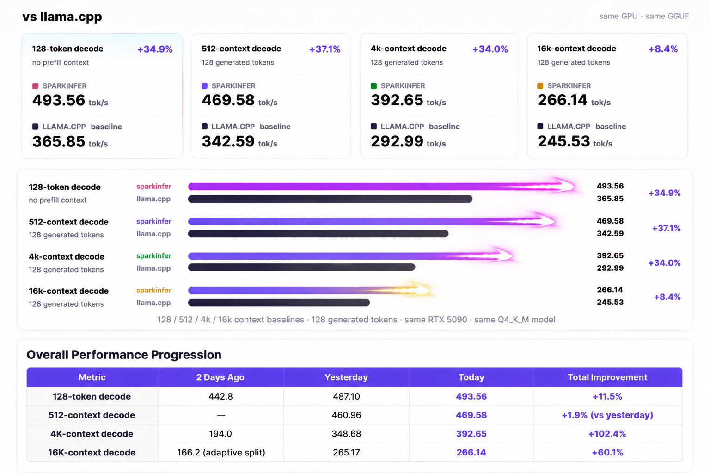
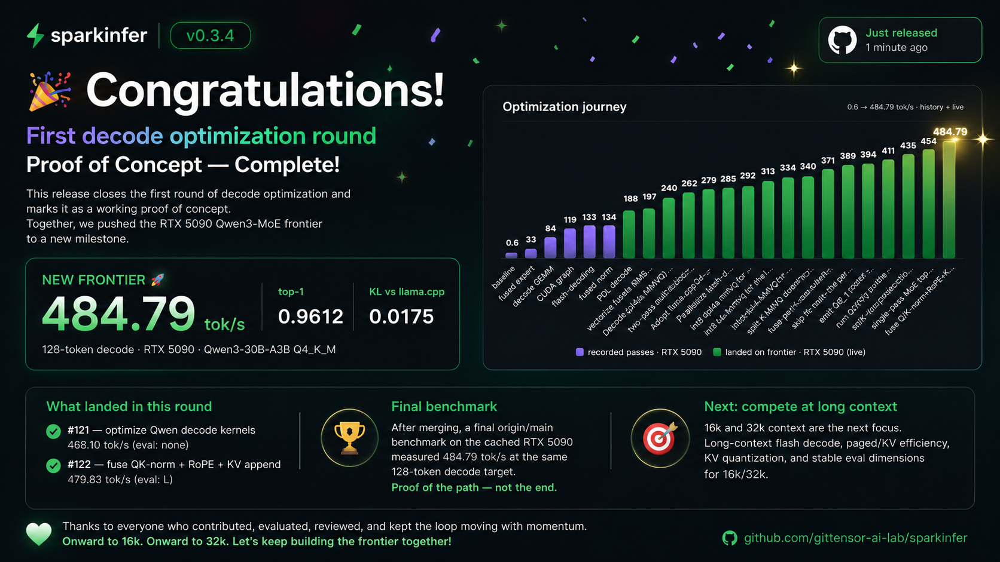

# Changelog

Notable changes to sparkinfer. Format loosely follows [Keep a Changelog](https://keepachangelog.com);
versions track the GitHub [releases](https://github.com/gittensor-ai-lab/sparkinfer/releases).

## [Unreleased]

### Fixed

- **A failed CUDA-graph capture was marked ready, and a destroyed decode graph kept its handles.**
  The decode, DSpark decode, prefill-position and verify graphs were marked ready even when ending
  the capture or instantiating it failed, and a split-count change destroyed the decode graph
  without clearing its handles. Either way a later replay, park or destroy could hand libcuda a
  graph that no longer existed. A graph is ready now only if both steps succeeded; a failed verify
  capture declines to the per-row path, which loses nothing because capture records rather than
  runs. Once the CUDA context is lost, a request gets a 503 before any device work, rather than the
  prefix-cache handling issuing graph destroys against the dead context.
- **A replayed prefill graph could write through freed scratch, and libcuda segfaulted on it.**
  A short prompt's batched prefill is recorded as a CUDA graph and replayed for every later
  prompt of the same length, with the scratch it was recorded against baked in. Passes that never
  replay a graph -- a prefix-cache resume, a DSpark prefill that captures hidden states, an early
  return -- can still grow that scratch, and growing frees the old buffers. The next same-length
  prompt then replayed the graph against freed memory: its prompt-id upload fails libcuda's
  copy-destination check with a host SIGSEGV, which is where the serve-dspark exits at
  `libcuda.so.595.84+0x14DD6E` land, and its kernels run on freed memory. Reproduced on v0.5.10
  with the Qwen3.8 NVFP4 checkpoint: a long prompt the prefix cache keeps, a short prompt twice, a
  cache-hit continuation larger than anything before it, then the short prompt again. The graph
  now records the arenas' generations and a kernel-scratch epoch at capture and is dropped when
  either has moved, and it is dropped before its pinned id buffer is freed. On earlier releases,
  `SPARKINFER_MUSE_PREFILL_GRAPH=0` avoids it at the cost of the graph's prefill speedup.
- **A concurrent request could be served from a recurrent state read at the wrong width.**
  Continuous-batch decode compacts a session's Gated-DeltaNet state to bf16, packed from the
  allocation base, the first time it packs that session. Three things disagreed with that
  representation, and all three produce fluent output that degenerates a few tokens in rather
  than an error:
  - `launch_qwen36_gdn_ar` took a pointer the caller had already advanced to the layer's slot,
    while its batched twin took the base pointer and a separate `state_off`. Under the compacted
    form the slot offset counts bf16 elements, so advancing a `float*` by it landed every slot at
    twice its byte offset — layer 0 correct, every other GDN layer reading a slot it does not
    own. Both launchers now take `(state, state_off)`.
  - The decode CUDA graph bakes which representation its kernels read, but its validity key was
    only `(attn_mode, sparse, n_splits)`. A request that decodes alone, joins a batch, then
    outlives it replayed its fp32 capture over a compacted state. The representation is now part
    of that key, and is parked and restored with the graph.
  - A packed batch whose rows did not agree on the representation — the shared prefix session, a
    missing one, a failed conversion, or any row once `SPARKINFER_CB_GDN_STATE_B16=0` is set on a
    process that had already compacted some — ran one kernel instantiation over both kinds. It is
    declined now; the per-row fallback consults each session's own flag.

  The unbatched kernel serves a row whenever the packed batch declines **or decays to a single
  live row**, so this is reachable on the default path for every hybrid model at concurrency, as
  a batch's requests finish at different lengths. `gdn_batched_gpu_test` covered a non-zero slot
  offset and passed throughout, because it only ever ran fp32; it now runs the compacted form
  too. The reproduction is to ask one prompt at temperature 0 alone and again inside a batch that
  decays to one row, and compare — a flat concurrent batch does not show it.
- **A verify decline is reported once, not once per decode step.** A model the packed path cannot
  drive declines forever, and the decline sites wrote to stderr unconditionally — two lines per
  decode token, on top of whatever else the log was meant to show.

## [0.5.10] — 2026-09-17

**An assistant message can be sent back exactly as it arrived.** A response carries `reasoning`
beside `reasoning_content`, streamed and not, but the request validator accepted only
`reasoning_content`: a client that appends the message it just received — `message.model_dump()`,
the standard OpenAI SDK pattern — got `400 … contains unsupported field reasoning` on its next
turn, which breaks any multi-turn agent. The SDKs carry `refusal`, `annotations`, `audio` and
`function_call` as nulls in that same object, so those are accepted now too.

`reasoning` is used rather than ignored: it holds the same text, and since 0.5.9 a previous turn's
reasoning is replayed into the prompt, so a client that kept only that field still gets its
thinking back. `reasoning_content` stays canonical when both are present. A field the server never
emits is still reported by name — the strictness is what made this easy to find.

## [0.5.9] — 2026-09-17

**The release container runs as a Gittensor compute-pool workload**, verifying pre-staged weights
against a signed manifest instead of downloading anything, and a conversation's reasoning now
survives the whole history the way the checkpoint's own chat template intends.

### Serving

- **Compute-pool manifest and artifact-verifying entrypoint** (#1098). The image ships
  `docker/gittensor-manifest.yaml` (placement, env, artifacts by HF revision + sha256, health
  probe, tool-call entry canaries, drain) and an entrypoint that, with
  `SPARKINFER_NO_DOWNLOAD=1`, hashes every artifact on disk before serving and refuses to start on
  a mismatch. `SPARKINFER_MODE=serve-dspark` selects the drafter from the environment for
  orchestrators that set env but not arguments. Without those variables the entrypoint is a
  pass-through: `docker run … serve-dspark` and `bench` behave exactly as before.

### Chat

- **A previous turn's reasoning is replayed for the whole history** (#1094), as the pinned
  template does: its rule is `reasoning and (preserve_thinking or index0 > last_user_index)` with
  `preserve_thinking` defaulting to true, and only the second half of that was implemented — every
  thought from before the latest user turn was dropped, which is the coherence loss long agent
  sessions reported. `chat_template_kwargs.preserve_thinking` sets it per request and
  `SPARKINFER_PRESERVE_THINKING=0` server-wide (llama.cpp calls this `--reasoning-preserve`). An
  assistant turn with no reasoning no longer gets an empty `<think></think>` block.

### Performance — Muse Glimmer

- Narrow packed decode: FFN kernels sized to the batch (1.08x concurrent decode @c2, #1097), and
  attention plus the LM-head Q4_K rows kernels run at the batch width (1.03x @c2, #1100).
- Prefill: the o-proj streams to NVFP4 with operands built straight from Q4_K (1.02x @16k–64k,
  #1101), and the Q4_K → NVFP4 operand kernel decodes only each lane's own eight values while
  sharing the group amax (1.05x prefill @4k, #1102).

### Project

- A listed account's eval tiers are parked as `<tier>-p` for three days and then restored exactly
  as measured (#1099); CONTRIBUTING says what that does, what it never touches — nothing is closed,
  re-scored, or thrown away, and contesting a verdict is not noise — and how to contest a listing.

## [0.5.8] — 2026-09-16

**Long agent sessions work.** Past 16,384 tokens, decode attended only the attention sink and the
most recent 4,096 tokens: everything in between was invisible to the tokens being generated, so an
agent lost sight of its own session within a few turns. That was a default-on decode optimisation
(#958) whose accuracy gate never used a prompt long enough to reach it. Exact attention is the
default again; `SPARKINFER_SPARSE_GQA6=1` opts back in. This release also ends a lease cleanly for
an orchestrator, refuses with a body a client can classify, and fixes eight further faults a real
`prime-agent` session hit on `serve-dspark`.

### Long context and agent sessions (#1088)

Found by running real pi agents against `serve-dspark` at `--ctx 131072`, then reproducing each
fault on its own:

- **Exact attention above 16K.** A 44,000-token prompt with one `ERROR` line 20,000 tokens back
  answered "There is no line containing ERROR"; it now quotes the line and the one before it.
  Long-context decode is slower for it (95 → 85.7 tok/s at ctx 32768).
- **Prompts longer than the draft context** no longer fail with `speculative decode failed`: the
  drafter's eligibility now bounds the whole prompt, not the captured window.
- **Reasoning streams live in tool-calling turns.** A turn that offers tools buffered everything
  until the tool XML was complete, so an agent saw nothing for minutes and got an empty message if
  the turn hit its token limit. Reasoning now streams, and a truncated turn keeps it.
- **A request without `max_tokens`** generates to the output cap or the room its prompt leaves,
  not 256 tokens.
- **A request that omits temperature** takes the checkpoint's `generation_config.json` sampling
  rather than greedy decoding; `SPARKINFER_SAMPLING_DEFAULTS=greedy` restores the old behaviour.
- **Capacity waits instead of refusing.** A request that finds no free KV, or whose session memory
  is held by requests already running, waits in admission (`SPARKINFER_ADMISSION_WAIT_S`, default
  300) instead of returning 429/503 at once. `0` refuses immediately.
- **A cached prefix followed by a long continuation** is windowed rather than dropped onto the
  token loop: time to first token for a 44K-token prompt fell from 348 s to 4.7 s.
- **DSpark capture buffers are freed** with the capture, and a handled allocation failure elsewhere
  no longer fails a request that finished.
- **Context overflow** returns OpenAI's wording and `code: context_length_exceeded`, which is what
  agent clients match to compact their history and retry.

### Deployment (#1090)

- **Drain.** `SIGTERM` exits as soon as nothing is running and nothing waits for capacity — 0.34 s
  for an idle instance, where it used to sit out the full grace period.
- **`SPARKINFER_DRAIN_GRACE_S`** (default 30, `SPARKINFER_SHUTDOWN_GRACE_S` still read); `0` waits
  for in-flight work as long as it takes.
- **Failure bodies carry OpenAI's `type` and `code`**, streamed and not: `rate_limit_error` /
  `server_overloaded` for 429, `server_unavailable` for 503, `request_timeout` for 504.
- **`SPARKINFER_NO_DOWNLOAD=1`** serves pre-staged weights and never reaches for the network.

### Performance

- Prompts that arrive together are prefilled in one packed pass (#1089).
- Q4_K attention k/v and gate/up on the int8 tensor cores; cheaper staging and a single-pass FP8
  row quantize (#1085, #1091).
- Muse Glimmer: packed decode projects q, gate, k and v in one launch (#1092); Gated-DeltaNet
  recurrent state held only for the layers that have it.

### Serving and docs

- `serve-dspark` defaults to `--ctx 131072`, and a drafter that cannot fit fails startup with what
  to lower (#1086).
- Serving Qwen3.8 from a Q4_K_M GGUF, and what differs from NVFP4 (#1087).

## [0.5.7] — 2026-09-14

**Tool calls and structured output are grammar-constrained.** Every token of a tool-calling or
`response_format` turn is sampled under a grammar that admits only output the server accepts, so a
well-formed request no longer gets a 502 for an invalid call. The server also serves Qwen3.8 with
DSpark speculative decoding, byte-identical to ordinary decode and decoding 2.5–3.5x faster on
code, math, JSON and long-prompt requests in a deterministic-mode A/B. It reuses cached prompt
prefixes, and it speaks the Anthropic Messages and OpenAI Responses APIs.

### Tool calls

On 0.5.6, valid tool-calling requests could return 502 in several ways. All are fixed (#1073).

**Constrained decoding.** Every token of a tool-calling turn is sampled under an
[xgrammar](https://github.com/mlc-ai/xgrammar) grammar that mirrors the server's own parser:

- reasoning and content free of protocol markup;
- calls only to offered functions: at least one for `"required"`, only the named one for a named
  choice, and at most one with `parallel_tool_calls: false`;
- every argument in the template's exact framing, with a value its schema allows: enums, consts,
  numeric ranges, string lengths and patterns, nested objects and arrays, `$ref`, and
  `anyOf`/`oneOf`/`allOf`.

`response_format` is constrained the same way. `json_schema` output is exactly a value the schema
accepts, and `json_object` output is always a JSON object.

The grammar is compiled once per distinct tool set, and a token's mask is uploaded only when it
changes. At equal output length, constrained decode costs under 1% (455 vs 458 tok/s on Qwen3.6).
`SPARKINFER_TOOL_GRAMMAR=0` turns the grammar off. `/metrics` counts
`sparkinfer_tool_calls_constrained_total` and `sparkinfer_structured_output_constrained_total`.

**Also fixed:**

- **`$ref` parameters** were resolved against the property instead of the tool's `parameters`
  schema. Every call to a tool with a nested pydantic or zod model failed.
- **`tool_choice: "required"` and named functions** were an instruction plus a check after
  generation, so a model that answered in prose got a 502. Both are now enforced. With the grammar
  off, the turn starts inside the call, and a missing call gets one retry from the model's reasoning
  (`sparkinfer_tool_calls_forced_total`).
- **`parallel_tool_calls: false`** failed a response that had more than one call. The first call is
  now returned.

**Measured.** 37 live checks through the `openai` SDK on Qwen3.8-27B NVFP4 pass 37/37: with the
prefix cache on, with it off, and on a DSpark server. They cover:

- streaming and non-streaming calls, and tool-result follow-ups;
- every `tool_choice` mode, with thinking on and off, including prompts no offered tool fits;
- nested `$ref`, `parallel_tool_calls: false`, `n=2`, stop sequences, and an image with a tool call;
- a schema using every supported keyword, sampled 12 times;
- `json_schema` and `json_object` output.

**Limits.**

- A turn that runs out of `max_tokens` mid-call returns an empty message with
  `finish_reason: "length"`, since a partial call cannot be executed.
  `SPARKINFER_LOG_TRUNCATED_OUTPUT=1` writes the generated tail to stderr.
- Some schemas cannot be expressed exactly as a grammar: overlapping `oneOf` branches, a `pattern`
  inside a JSON value, a non-integer or unbounded `multipleOf`, and a free-form object whose keys
  could repeat. For those the server logs the approximation and still validates the arguments
  afterwards, so such a call can still fail.
- Argument text can contain `<`, except where it would start protocol markup (`<tool_call>`,
  `</parameter>`, …). A string with `minLength` or `maxLength` cannot contain `<` at all. Numbers
  have at most 18 integer digits and a two-digit exponent.
- Qwen3.6-35B-A3B can reason in a loop until `max_tokens` when thinking is on, the choice is
  `"required"` and no offered tool fits: 5 of 6 greedy runs did. It loops without the grammar too
  (3 of 6, plus a 502). Qwen3.8 does not.

### Correctness

These affected 0.5.6.

- **Temperature sampling emitted a random token on about 1.5% of steps.** The Gumbel noise
  `-log(-log(u))` is +inf when the uniform draw is exactly 1.0. That happens about once in 2^24
  draws, and a step draws once for each of the 248K vocabulary entries. The token with +inf noise
  won whatever its logit, even under `logit_bias` −100. Greedy decoding was unaffected (#1073).
- **Prompts past 32,768 tokens lost their Gated-DeltaNet state.** Windowed prefill runs in 16K
  windows, and every window after the first restarted the Gated-DeltaNet layers (48 of them on
  Qwen3.8-27B) from zero. Nothing caught it because the accuracy gates stop at 32K. The state now
  carries into each window, and a pass at position 0 runs the same arithmetic as before (#1071).
- **`logit_bias` did not apply to a response's first token**, which comes out of batched prefill.
  It was also dropped whenever the request was decoded in a packed batch with another request.
  Requests with `logit_bias` now stay out of packed batches (#1073).
- **Graceful shutdown always waited the full 30 s grace period**, even when idle. Under Docker's
  default 10 s stop timeout the container was SIGKILLed instead. The server now exits as soon as
  in-flight requests drain: within 3 s idle, against 30.6 s before (#1079).

### DSpark in the server

`sparkinfer_server` serves Qwen3.8 with DSpark speculative decoding (#1076). The release container
downloads the drafter and turns it on:

```bash
docker run --gpus all -p 8080:8080 -v qwen38:/models \
  ghcr.io/gittensor-ai-lab/sparkinfer-qwen38:0.5.7 serve-dspark
```

From source, pass `--draft-model`. If a drafter is requested but missing or incompatible, the
server stops at startup rather than silently serving without it.

DSpark runs only for a greedy, plain-text request while it is the only active request. The
following use ordinary decode:

- sampling, penalties, `logit_bias` and logprobs;
- images and video;
- tool calls and `response_format`;
- a request that reuses a cached prefix.

When a second request arrives, the speculative one hands over at a committed token and continues
in the batch.

**Lossless, measured.** Qwen3.8-27B NVFP4 on an RTX 5090 with `SPARKINFER_DETERMINISTIC=1`, one
request at a time, against the same server with no drafter. That reference was recorded twice and
matched itself. Every output is byte-identical to it:

| request | decode speed vs no drafter |
|---|--:|
| json | **3.45x** |
| code | **2.86x** |
| long (3,201-token prompt) | **2.54x** |
| math | **2.45x** |
| chat | **1.47x** |
| 371-token prompt whose answer crosses 512 tokens | 1.01x |

A request handed over mid-answer (2,588 characters) and an ordinary request sent after speculative
ones were byte-identical too. These are deterministic-mode numbers; default-mode speed was not
measured for this release.

Two issues were fixed before release (#1078):

- **Speculation stops at the next attention split tier** (the first is 512 tokens of context), and
  ordinary decode finishes the request. That is why the last row gains nothing.
  `sparkinfer_speculative_tier_stops_total` counts these stops, next to
  `sparkinfer_speculative_runs_total`, `_tokens_total` and `_handoffs_total`.
- **The drafter read a stale context between 384 and 1,024 tokens of context.** It happened after
  every fully accepted block. Output stayed lossless, but acceptance suffered.

### Automatic prefix cache

Chat and agent clients resend the whole conversation on every turn. The server now reuses the part
it already computed, and this is on by default (#1072). Measured on an RTX 5090, Qwen3.8-27B NVFP4,
`--ctx 32768`, with an 11.5K-token system prompt:

| | cache on | cache off |
|---|--:|--:|
| time to first token, turns 2–4 of one conversation | **249–313 ms** | 834–1,592 ms |
| 12 concurrent conversations on that system prompt | **12/12 served** | 2/12 (10 × `429`) |

**How it works.**

- KV blocks are shared, not copied, so a conversation on a cached system prompt allocates blocks
  only for its own suffix.
- The recurrent state is snapshotted at up to two checkpoints per prompt into pinned host memory
  (~205 MB each on Qwen3.8-27B).
- A hit prefills only the remainder.

Responses report `usage.prompt_tokens_details.cached_tokens`, and `/metrics` adds
`sparkinfer_prefix_cache_*`.

**Bounds.** At most 32 entries, 8 GiB of pinned host memory (`SPARKINFER_PREFIX_CACHE_HOST_MB`) and
half the KV pool. The least-recently-used entry is evicted first, including when a new request
cannot otherwise get KV blocks. Nothing is cached for `/v1/score`, for image or video requests, or
under `SPARKINFER_DETERMINISTIC=1`. `SPARKINFER_PREFIX_CACHE=0` turns the cache off.

A crash under concurrent load with the cache on was fixed before release (#1077). After the fix the
server survived a 12-conversation stress test, then passed the tool suite. That run had 42 cache
hits and reused 482,688 tokens.

### Anthropic Messages and OpenAI Responses APIs

| route | for |
|---|---|
| `POST /v1/messages` | Anthropic Messages API: Anthropic SDKs and clients that take an Anthropic base URL |
| `POST /v1/messages/count_tokens` | Anthropic token counting, including `system` and `tools` |
| `POST /v1/responses` | OpenAI Responses API, stateless |

Both translate onto `/v1/chat/completions`, so they share its generation, constrained tool calls,
schema validation, images, reasoning and sampling (#1070). Each streams in its own API's format:
numbered content blocks for Anthropic, and sequence-numbered output items ending in
`response.completed` for Responses. Errors come back in each API's own shape, on streams too.

**Refused with 400** rather than quietly degraded:

- Anthropic server tools (`web_search`, `bash`, …), `document` and `search_result` blocks, and images
  inside `tool_result`;
- Responses `previous_response_id`, `conversation`, `item_reference`, `background`, non-function
  tools and file inputs.

Nothing is stored: `GET` and `DELETE /v1/responses/{id}` return 404, so send the whole conversation
in `input`. Anthropic `stop_reason` is `end_turn` for both end-of-sequence and a stop sequence.

**Measured.** 14 of 14 live checks pass through the official `anthropic` 1.5.0 and `openai` 3.13.0
SDKs, whose stream helpers rebuild the final message from the events. The checks cover plain
replies, streams with thinking or reasoning, forced tool calls, tool-result follow-ups, token
counting and error shapes. `/v1/chat/completions` and Ollama streams are unchanged.

Not re-measured for this release: the vLLM and SGLang comparisons.

## [0.5.6] — 2026-09-14

**SparkInfer decodes faster than vLLM at every concurrency from 2 to 32 streams** on Qwen3.8-27B
NVFP4 — 1.34x at 2, 1.14x at 16, 1.07x at 32 — and the server now speaks the LM Studio and Ollama
APIs alongside OpenAI's.

### Concurrent decode versus vLLM

Same box, same checkpoint, same workload. Three reps per point, median reported.

| concurrent streams | SparkInfer | vLLM 0.29.0 | SparkInfer vs vLLM |
|---:|---:|---:|---:|
| 2 | **187.6 tok/s** | 139.7 | **+34.3%** |
| 4 | **327.5** | 271.0 | **+20.8%** |
| 8 | **623.4** | 530.9 | **+17.4%** |
| 16 | **1,079.6** | 947.0 | **+14.0%** |
| 32 | **1,597.5** | 1,496.1 | **+6.8%** |

The three reps at every point agree within 1.1% for vLLM and within 0.4% for SparkInfer.

**Setup.** RTX 5090 (32 GB), `gittensor-model-hub/Qwen3.8-27B-NVFP4-RTX5090`. Each run starts C
streams of a 256-token prompt → 256 generated tokens, then injects one 512-token prompt → 8 tokens
50 ms later, so a prefill lands in the middle of the batch. Greedy with EOS ignored, so every stream
emits exactly its budget. Throughput is decode tokens ÷ wall time for the whole run.

Neither side goes through HTTP. SparkInfer runs `qwen3_gguf_cb_bench` — the same
`ContinuousBatchEngine` the server uses, with the server's defaults (NVFP4 prefill and decode, int8
KV). vLLM runs `AsyncLLMEngine` in-process with CUDA graphs on, `max_model_len=1024`,
`max_num_seqs=64`, and the checkpoint's own FP8 KV cache.

**vLLM at 32 streams is memory-bound, and the table uses its best setting.** For this hybrid model
vLLM sets the attention block size to 1,568 tokens so a page can hold a Gated-DeltaNet state, which
leaves room for few sequences. At `gpu_memory_utilization=0.82` it reports a maximum concurrency of
16 and measures 958 tok/s at 32 streams — half the requests wait. Raising it to 0.90 gives 23 and
1,484 tok/s; **0.94 gives 27 and 1,496 tok/s**, the figure above. That last step bought 16% more room
for under 1% more throughput, so vLLM is near its ceiling; room for all 32 would need about 0.99,
which a 32 GB card does not have. At 16 streams and below capacity does not bind — vLLM measures
938–950 tok/s at 16 streams on all three settings — so those rows use 0.82.

Not claimed here: the HTTP servers, more than 32 streams, longer prompts, or any other engine at
concurrency. The SGLang and DSpark tables from 0.5.4 were not re-measured for this release.

### What changed in concurrent decode

0.5.5's packed forward (#975) now runs its wide projections on the block-scaled NVFP4 GEMM:

- the wide batch and the Gated-DeltaNet projections take the block-scaled GEMM (#990, #991), and
  wide batches no longer fall back to the row-GEMV (#993)
- the LM head is served from the checkpoint's own NVFP4 (#997)
- the batch ramps up at once instead of one or two rows per iteration (#994, #1002)
- projections are computed transposed, on a tile sized to the packed row count, LM head included
  (#1060, #1062, #1066)
- the continuous batch holds its Gated-DeltaNet state in bf16 (#998), runs the gate projection on
  the side stream it already joins (#1059), and overlaps the gate and up projections (#1061)

The eval now scores concurrent decode at 2, 4, 8, 16 and 32 streams (#978, #988), so a regression
here cannot land unnoticed.

### Correctness

- **32K prefill: 47 of Qwen3.8's 48 Gated-DeltaNet layers took their decay gate and update rate
  from layer 0's normalisation.** An FP4 norm deferral skipped the refresh those projections read.
  Fixed from 32,768 tokens (#989). Between 16,384 and 32,767 the previous behaviour is kept for
  now: the DSpark drafter is calibrated against it, and correcting it there lowered acceptance.
- **`POST /v1/score` could score the wrong token.** The token id reached the GPU through a copy
  that was not ordered against the kernel reading it, so the kernel could read the previous id —
  about 22 nats off at position 1 in the report. The id is now passed by value (#1016, fixes #1001).
- **Deterministic mode is faster and more accurate.** It still forced the non-fused GQA prefill on
  the strength of a bug #980 had already fixed (#982).

### Server

**LM Studio and Ollama APIs** beside OpenAI's `/v1` (#1015):

- LM Studio: `/api/v0/models`, `/api/v0/chat/completions`, `/api/v0/completions`, with LM Studio's
  `stats`, `model_info` and `runtime` blocks
- Ollama: `/api/version`, `/api/tags`, `/api/ps`, `/api/show`, `/api/chat`, `/api/generate`,
  streamed as NDJSON

Both translate around the handlers `/v1` already uses — there is no second generation path, and
`/v1` responses are byte-identical to before. Streaming is incremental on all three. Embeddings and
Ollama's model-management endpoints (`pull`, `push`, `create`, `copy`, `delete`) return 501 with a
reason rather than a bare 404.

**Tool schemas.** 0.5.5 said `$ref` and `$defs` return 400; they are now enforced (#985, #981).

- `const`, `anyOf`, `oneOf`, `multipleOf`, `allOf`, `prefixItems`, and local `$ref` against
  `$defs`/`definitions` are checked against the model's arguments, not merely accepted
- `x-*` vendor extensions from MCP servers are accepted and ignored; `format` is ignored, as the
  spec defines it as an annotation
- an external `$ref` is refused rather than fetched, and a `$ref` with sibling keywords is refused
  rather than silently dropping them
- a `$ref` that points at nothing is rejected when the tool is registered, not on the first call
  that reaches it
- tool names fall back to a case-insensitive match — Qwen3.8 emits `Read` for an offered `read` —
  and the call comes back under the client's own spelling

Still refused: `not`, `if`/`then`/`else`, `patternProperties`, `uniqueItems`, `contains`,
`propertyNames`, `dependentSchemas`, `dependentRequired`.

`/v1/models` advertises `video` input, but only when `ffmpeg` is available to decode it (#985).

### Prefill

Eval-bot figures per PR, not re-measured together for this release:

- 256K: the attention's V operand read in the PV layout (1.10x, #999); the six-head K operand
  coalesced (1.06x, #1005)
- 4K: the scored prefill attention runs on the 16K tier (1.06x, #1000)

### Muse Glimmer

Muse Glimmer now honours an int8 KV cache instead of writing bf16 into it (#1006). With int8 KV —
what the example tools select at 4,096 tokens and up — it produced garbage and fell back to
token-at-a-time prefill. The server was not affected: it keeps Muse Glimmer on bf16 KV.

Beyond that fix, 35 Muse Glimmer performance PRs landed across prefill, long-context decode
and concurrent decode. They are not benchmarked against other engines in this release.

### Contributing

- There is no target optimization: optimize anything, and ask for an eval axis if none measures
  your change (#1024).
- PRs declare their target model, and each eval bot skips PRs that cannot move its axes (#1027).
- A PR scored `none` or `REJECT` is closed on its first result.

## [0.5.4] — 2026-09-04

**SparkInfer is faster than SGLang across the matched workload matrix**, and Qwen3.8-27B now
accepts image input. DSpark speculative decode is additionally measured at 16K and 32K, which
0.5.3 declined to claim.

### Versus SGLang

The engine-versus-engine result stands as measured in 0.5.3: both engines on the same prompts,
same box, same 4K / 128-token shape. SparkInfer was faster in every workload of that matrix.

| workload | SparkInfer | SGLang | delta |
|---|---:|---:|---:|
| chat | **167.92 tok/s** | 114.56 tok/s | **+46.6%** |
| code | **171.89 tok/s** | 170.32 tok/s | **+0.9%** |
| math | **249.08 tok/s** | 225.09 tok/s | **+10.7%** |
| JSON | **202.88 tok/s** | 202.33 tok/s | **+0.3%** |
| repetition | **406.85 tok/s** | 398.61 tok/s | **+2.1%** |

This release does not re-measure SGLang, and makes no SGLang claim at 16K or 32K.

### DSpark decode across context

RTX 5090 · target `gittensor-model-hub/Qwen3.8-27B-NVFP4-RTX5090` · draft
`gittensor-model-hub/Qwen3.8-27B-DSpark-NVFP4` · greedy batch size 1 · 128-token output ·
thinking disabled · best of 3 · every row byte-identical to SparkInfer's own AR output.

| workload | 4K | 16K | 32K |
|---|---:|---:|---:|
| chat | **306.0** | 133.7 | 131.3 |
| code | **379.6** | 242.2 | 163.4 |
| math | **355.6** | 260.0 | 233.0 |
| JSON | **348.6** | 298.4 | 243.1 |
| repetition | **436.8** | 349.4 | 297.1 |
| **mean speedup over AR** | **4.01x** | **2.97x** | **2.63x** |

The AR reference is measured in the same process and model load: 91.0 tok/s at 4K, 86.4 at 16K,
81.3 at 32K. Speculation stays lossless — a draft token is emitted only after the target verifies
it exactly.

Two caveats worth stating plainly. **This table is not comparable to the SGLang table above**: the
prompt corpus differs, 0.5.3's was never committed, and the same engine measures 167.9 on that
corpus and 306.0 on this one — most of that gap is prompts, not code. And the `counting` workload
is omitted here; it sits nearest the block-size ceiling, where tau swings between 3.3 and 7.5 on
prompt details alone, so its per-context figures are not stable enough to publish.

This release therefore ships the corpus (`bench/scripts/workloads.py`) with the three methodology
choices that dominate any result: 128 generated tokens, thinking disabled, and prompts capped at
`max_seq`. Reproducing 0.5.3 required rediscovering all three.

### Image input

`/v1/chat/completions` accepts OpenAI `image_url` content parts on checkpoints that ship a vision
tower. Several images per request, interleaved with text, each expanded to the token count its own
resized grid needs. `data:` URLs only — remote fetching is refused as an SSRF primitive.
See [`docs/image_input.md`](docs/image_input.md).

The tower is verified against `transformers`' own `Qwen3_5VisionModel` rather than a
re-implementation. That mattered: a hand-written reference and the CUDA both omitted the tower's
2D rotary position embeddings and agreed with each other at cosine 0.999 while both disagreed with
the real implementation at 0.77. Preprocessing is checked against the real `Qwen2VLImageProcessor`
to within one uint8 LSB.

### Also

- Target decode at 256K is now a scored dimension, taken from the sweep that already runs.
- The DSpark eval no longer reports stages that never ran as failures; a fail-fast round shows the
  one reason it stopped instead of nine.
- The server reports the model it actually loaded, and advertises image input when a vision tower
  is present.
- Added `server/scripts/diagnose_concurrency.py`, a reproducible 6/8/10/12-stream diagnostic that
  captures external token throughput, request accounting, capacity, container configuration, GPU
  telemetry and PCIe state in one JSON report.
- Documented the exact trust boundary and compatibility semantics of the server's `ttft_ms`,
  `generation_ms` and `decode_tps` fields. They are engine telemetry, not trusted billing or
  reward measurements.
- Clarified that deterministic concurrent batching is promised only for a qualified runtime,
  artifact, configuration and GPU-model tuple.
- Clarified that `SPARKINFER_MAX_QUEUE_DEPTH=0` is unlimited admission and that deployments which
  require immediate overload rejection must configure a finite cap.

## [0.5.3] — 2026-08-31

SparkInfer's Qwen3.8-27B + DSpark path is faster than the pinned SGLang comparison in every
workload of the matched **4K-context, 128-generated-token** matrix on one RTX 5090. This is a
4K result; it does not claim the same ordering at 16K or 32K.

RTX 5090 · target `gittensor-model-hub/Qwen3.8-27B-NVFP4-RTX5090` · draft
`gittensor-model-hub/Qwen3.8-27B-DSpark-NVFP4` · greedy batch size 1 · fixed 128-token output · exact output match
against SparkInfer AR.

> **Metadata correction (2026-08-31):** the original release text incorrectly named the
> upstream RadixArk BF16 draft. The measurements used Gittensor's matching 1.4 GB NVFP4 draft;
> benchmark numbers and generated outputs are unchanged.

| workload | SparkInfer | pinned SGLang | SparkInfer delta |
|---|---:|---:|---:|
| chat | **167.92 tok/s** | 114.56 tok/s | **+46.6%** |
| code | **171.89 tok/s** | 170.32 tok/s | **+0.9%** |
| math | **249.08 tok/s** | 225.09 tok/s | **+10.7%** |
| JSON | **202.88 tok/s** | 202.33 tok/s | **+0.3%** |
| repetition | **406.85 tok/s** | 398.61 tok/s | **+2.1%** |
| counting | **406.00 tok/s** | 376.90 tok/s | **+7.7%** |

The release improves row-batched NVFP4 projection kernels, prefill dispatch and DSpark verifier
planning. Deep-confidence streams retain full-width verification, while less predictable streams
avoid verifier rows whose cost would exceed their expected accepted-token value. Speculation
remains lossless: draft tokens are emitted only after exact target verification.

## [0.4.5] — 2026-08-10

sparkinfer's **plain autoregressive decode is ~2× llama.cpp** on Qwen3.6-35B-A3B — flat across
every measured context, no speculation involved. Layered on top, **DFlash is up to 3.9× faster
than llama.cpp's own native `draft-dflash`** at short context, same draft model on both sides.
DFlash also gained adaptive engagement this cycle: it watches whether the batched verify path can
actually pay off and falls back to plain AR when it can't, instead of paying speculative overhead
unconditionally — the exact failure mode llama.cpp's generic implementation falls into below.

### 🏆 2× llama.cpp in plain AR decode

RTX 5090 · same `UD-Q4_K_M` GGUF · greedy bs=1 · no speculation on either side · llama.cpp `6f4f53f`.

| context | SparkInfer AR | llama.cpp AR | Δ |
|---:|---:|---:|---:|
| 128 | **532** tok/s | 266 tok/s | **+100%** |
| 512 | **524** tok/s | 266 tok/s | +97% |
| 4k | **503** tok/s | 266 tok/s | +89% |

llama.cpp's AR throughput is essentially flat across context depth (266→266→266); SparkInfer holds
a ~2× lead at every point measured.

### ⚡ DFlash vs. llama.cpp's own `draft-dflash`

Same target GGUF, same draft model weights, best llama.cpp configuration found
(`--spec-draft-n-max` tuned — widening it to the draft's full trained block size made llama.cpp
*slower*, not faster: real per-position acceptance on this draft/target pair decays sharply past
the first couple of tokens, so a wider verify window mostly just pays for rejected speculation).

| context | SparkInfer DFlash | llama.cpp draft-dflash | Δ |
|---:|---:|---:|---:|
| 128 | **894** tok/s | 229 tok/s | **+290% (3.9×)** |
| 512 | **522** tok/s | 220 tok/s | +137% (2.4×) |
| 4k | **555** tok/s | 392 tok/s¹ | +42% (1.4×) |

¹ benefits from a corpus-repetition artifact in the held-out 4k prompt (source corpus is ~1.3k
tokens, tiled 3× to reach length) — treat as optimistic; 128/512 are clean.

**llama.cpp's own `draft-dflash` is slower than llama.cpp's own plain AR** at short/mid context
(229 < 266 at 128; 220 < 266 at 512) — its generic dispatch pays draft+verify overhead
unconditionally, and real acceptance on non-repeated text is only ~32-34% here, not enough to
break even. SparkInfer's DFlash never falls behind its own AR baseline at any measured context
(894/522/555 vs. 532/524/503) because of the adaptive engagement work below.

### DFlash — adaptive engagement (new this cycle)

- **#746** — skip speculation entirely where the batched verify can never engage, decided before
  prefill rather than mid-stream (that band runs one target forward per emitted token, identical
  to AR, plus a wasted draft forward)
- **#745** — engage the batched verify only on the evidence it will actually pay (1.09× at 128, 1.08× at 4k)
- **#720** — engage on a sustained run of full-block accepts, not a single partial accept (1.74× at 128)
- **#728** — run the row-batched verify at long context too (1.24× at 4k)
- **#710 / #711** — score DFlash across 128/512/4k (not just the short prompt); reject on
  accuracy or speed regression at *any* of them, not just the best number

### Optimizations landed since v0.4.4

**DFlash perf**

- **#636** — incremental early-exit verify (2.8×)
- **#661** — batched draft projections + LM head across the block (+11.5% DFLASH_TPS)
- **#663** — CUDA-graph replay for verify-loop decode tokens (+8.7% DFLASH_TPS)
- **#666** — hoist Q6_K unpack out of the draft head's multi-row loop
- **#694 / #700 / #701 / #717** — row-batched exact verification kernels, overlapped independent
  verify branches on a second stream, kept the block verify engaged with a prebuilt replay graph,
  row-batched KV-split draft attention
- **#707** — Q5_K MoE expert-down split-K row-count tuning (alongside an n_splits freeze fix,
  #714/#715/#716)

**Correctness / reliability**

- **#713 / #724 / #741** — per-device shared-memory opt-in hardening for the GQA MMA,
  windowed-attention, and GDN-chunk-scan prefill kernels — a refused opt-in now fails over to the
  correct fallback instead of silently reporting success over an unwritten buffer
- **#743** — fixed ContinuousBatchEngine leaving the shared prefix session marked active after
  freeing its KV (next request skipped re-warming, attended against an empty block table); also
  fixed a destructor bug that leaked the prefix session's KV entirely on engine teardown
- **#740** — fixed concurrent HTTP requests bleeding error state into each other, and an
  infinite-loop hang on essentially any multimodal chat request
- **#744** — fixed SSE streaming re-emitting the entire response whenever HF's decode wasn't
  prefix-stable (incomplete UTF-8 / BPE tail rewrite)
- **#718** — fixed `CMAKE_CUDA_ARCHITECTURES` set after `project(... CUDA)`, silently no-op'ing to
  `sm_52` on fresh configures
- **#699 → #721** — a claimed MoE expert-down requant optimization was re-evaluated, found to be
  within noise, and reverted

**Eval harness**

- **#645 / #683 / #738 / #742** — DFlash PR auto-eval bot (label tiers + auto-merge), Polaris TDX
  attestation for DFlash evals, auto-close on a genuine none/REJECT verdict, SSH reliability fix
  (`IdentitiesOnly=yes`) for the eval cron

### What changed since v0.4.4

| headline | v0.4.4 | v0.4.5 | shift |
|---|---:|---:|---|
| AR decode vs llama.cpp | not the headline | **~2× at every context (128/512/4k)** | **new headline** |
| DFlash vs llama.cpp's own draft-dflash | not measured | **up to 3.9× (3.9×/2.4×/1.4×)** | **new comparison** |
| DFlash engagement | always drafts when a draft is attached | **adaptive — skips where it can't pay** | **new** |

**Verified:** RTX 5090 · SparkInfer commit `15a604e` · llama.cpp `6f4f53f` · same box, same GGUF,
same session.

### Contributors

- **@widecloud** — #661, #663, #684, #696, #700, #701 (DFlash draft/verify performance tuning)
- **@JSONbored** — #720, #728, #746 (adaptive batched-verify engagement)
- **@FranDev132** — #707, #717, #745 (split-K down-proj tuning, KV-split draft attention, engage-on-evidence)
- **@kai392** — #740, #741 (server concurrency/multimodal hang, GDN-chunk smem hardening)
- **@RealDiligent** — #743, #744 (prefix-session staleness, SSE decode-delta duplication)
- **@rhu-3** — #747, #748, #749 (dashboard data-binding fixes)
- **@tryeverything24** — #713 (GQA MMA smem hardening)
- **@rsnetworkinginc** — #724 (windowed-attention smem hardening)
- **@Paral1995** — #636 (2.8× early-exit verify)
- **@nickmopen** — #666 (Q6_K unpack hoist)
- **@inference2026** — #694 (row-batched exact verification)
- **@skyrocket2026** — #645, #683, #710, #711, #718, #721, #738, #742 (eval bot, Polaris attestation, multi-context scoring, CMake fix, revert, auto-close, SSH reliability)

## [0.4.4] — 2026-07-28

sparkinfer lands **DFlash block-diffusion speculative decode** for Qwen3.6-35B-A3B — the first
opt-in multi-token draft path on the native GGUF runtime. Greedy DFlash matches autoregressive
bit-for-bit (`SPEC_AGREE = 100%`). Default generate stays AR; set `SPARKINFER_DFLASH=1` with the
z-lab draft weights to enable it.

Alongside DFlash, the Qwen3.6 **prefill frontier climbs again** (README: **+127% vs llama.cpp at
32k**) and continuous-batching **mixed-load TTFT drops ~97%** on the decode-first CB path.

### ⚡ DFlash — the main story

Block-diffusion draft (`z-lab/Qwen3.6-35B-A3B-DFlash` safetensors) + target UD-Q4_K_M GGUF on RTX 5090.

| | |
|---|---|
| **What** | Single-stream DFlash verify + draft KV (update-then-crop) |
| **Correctness** | Greedy **SPEC_AGREE 100%** vs AR (`qwen3_gguf_dflash_check` / `dflash_accuracy.sh`) |
| **Opt-in** | `SPARKINFER_DFLASH=1` when a draft is attached; AR path unchanged when unset |
| **Tools** | `qwen3_gguf_dflash_check`, `qwen3_gguf_dflash_bench`, `bench/scripts/dflash_accuracy.sh` |

CB/server multi-accept stays deferred until the single-stream path proves a tok/s win on top of
SPEC_AGREE (token-loop verify is the current correctness-first landing).

```bash
# Correctness gate (multi-seed SPEC + draft-KV canary)
bench/scripts/dflash_accuracy.sh /path/to/Qwen3.6-35B-A3B.gguf /path/to/Qwen3.6-35B-A3B-DFlash

# Throughput + mean accept length τ
build/runtime/qwen3_gguf_dflash_bench target.gguf draft_dir 64 <token-ids...>
```

### 🏆 Qwen3.6 SOTA — decode held, prefill higher

RTX 5090 · same `UD-Q4_K_M` GGUF · greedy bs=1 · llama.cpp `6f4f53f`.

#### Decode (frontier held / README)

| context | SparkInfer | llama.cpp | Δ |
|---:|---:|---:|---:|
| 128 | **512** tok/s | 276 tok/s | **+86%** |
| 512 | **506** tok/s | 276 tok/s | +83% |
| 4k | **486** tok/s | 276 tok/s | +76% |
| 16k | **467** tok/s | 281 tok/s | +66% |
| 32k | **437** tok/s | 280 tok/s | +56% |

#### Prefill (climbed since v0.4.3)

| context | sparkinfer (pp tok/s) | llama.cpp (pp tok/s) | vs llama |
|---|---:|---:|---:|
| **4k prefill** | **~13,800** | 8,726 | **+58%** |
| **16k prefill** | **~17,700** | 8,390 | **+111%** |
| **32k prefill** | **~18,150** | 7,984 | **+127%** |

Headline: **32k prefill +127% vs llama.cpp** (was +82.7% in v0.4.3).

### Serving — CB mixed-load TTFT

- **#597** — vLLM V1–style decode-first continuous batching + Qwen3.6 MoE batched prefill:
  **~−96.6% CB mixed-load TTFT** on the interrupt benchmark
- **#594 / #592 / #600** — score and guard CB mixed-load TTFT for Qwen3.5 and Qwen3.6

### Optimizations landed since v0.4.3

**DFlash**

- **#633** — DFlash block-diffusion speculative decode for Qwen3.6 (opt-in) + draft KV `seq_len` fix

**Qwen3.6 prefill / MoE**

- **#621** — routed MoE prefill GEMM reads native quantized experts (no int8 materialize)
- **#614** — tensor-core router logits, warp top-k, pipelined GDN scan, fused SwiGLU-quant (**~+24% pp at 32k**)
- **#609** — fast Q5_K gather dequant for MoE down cols=512
- **#598** — default MoE live-expert gather on
- **#595** — restore MoE FP8 prefill default (**~+30% pp at 16k**)
- **#583** — GPU MoE tilemap (skip D2H sync)
- **#582** — fp8 e4m3 tensor-core attn/GDN projections for MoE batched prefill
- **#577** — coalesce live MoE dequant + fused gate/up
- **#549** — int8 shared-expert MoE prefill

**Qwen3.5 / GDN / correctness**

- **#579** — ldmatrix GEMM staging, register-resident attention O, fused residual/quantize prefill
- **#573** — fp8 e4m3 GDN projections + fused SwiGLU-quant for Qwen3.5 long-ctx prefill
- **#608 / #604** — GDN chunk partial-buffer / final-state fixes

**Eval harness**

- **#588** — H3 `prefill_batched` fidelity veto
- **#589** — tier prefill labels by TTFT reduction vs main
- **#626** — reject mismatched Qwen3-30B tokenizer in models35
- **#627 / #628 / #630** — auto-merge merge-first winners; cron labels-only when GPU down; never rent

### What changed since v0.4.3

| headline | v0.4.3 | v0.4.4 | shift |
|---|---:|---:|---|
| Speculative decode | AR only | **DFlash opt-in (SPEC_AGREE 100%)** | **new** |
| Qwen3.6 prefill at 32k | ~14,587 pp/s (+82.7% vs llama) | **~18,150 pp/s (+127% vs llama)** | **~+24%** |
| CB mixed-load TTFT | not the headline | **~−96.6%** (decode-first CB) | **new** |

**Verified:** RTX 5090 · DFlash **SPEC_AGREE 100%** · Qwen3.6 decode **~512 tok/s at 128 (+86% vs llama)** ·
prefill **~18,150 pp/s at 32k (+127% vs llama)** · llama.cpp `6f4f53f`.

### Contributors

- **@skyrocket2026** — #633 (DFlash), eval CB TTFT gates (#594/#592/#600/#588/#589), tokenizer guard (#626), bot cron/automerge (#627/#628/#630)
- **@widecloud** — #621 (native quantized MoE GEMM), #614 (router / GDN / SwiGLU-quant prefill)
- **@Paral1995** — #597 (decode-first CB + MoE batched prefill TTFT)
- **@fansilas** — #595 (MoE FP8 default), #582 (fp8 attn/GDN), #579/#573 (Qwen3.5 prefill)
- **@James-CUDA** — #583 (GPU MoE tilemap), #577 (live MoE dequant + fused gate/up)
- **@inference2026** — #609 (Q5_K gather dequant), #598 (live-expert gather), #549 (int8 shared-expert)
- **@RealDiligent** — #604 (GDN chunk final-state gate)

## [0.4.3] — 2026-07-21

sparkinfer's **prefill stack is the headline of this release**: Qwythos (Qwen3.5) is now
**+183.6% faster than llama.cpp at 128k prefill**, and Qwen3.6 is **+82.7% faster at 32k prefill** —
both on the same RTX 5090 / pinned llama.cpp commit (`6f4f53f`). The live chat at
**[sparkinfer.com/chat](https://sparkinfer.com/chat)** now serves **Qwen3.6**.

### ⚡ Prefill — the main story

Dense + MoE prefill landed a chain of weight-amortized and int8 tensor-core wins since v0.4.2.
Long-context prompt processing is where agents feel latency first — this release closes that gap
past llama.cpp at the lengths that matter.

#### Qwythos (Qwen3.5-9B) · Q4_K_M · RTX 5090

| context | sparkinfer (pp tok/s) | llama.cpp (pp tok/s) | vs llama |
|---|---:|---:|---:|
| **4k prefill** | **~19,580** | 11,105 | **~+76%** |
| **32k prefill** | **~20,170** | 9,772 | **~+106%** |
| **64k prefill** | **~20,150** | 8,154 | **~+147%** |
| **128k prefill** | **~17,015** | 6,000 | **+183.6%** |

Headline: **128k prefill +183.6% vs llama.cpp** (17,015 vs 5,999.59 pp tok/s; #557).

#### Qwen3.6-35B-A3B · UD-Q4_K_M · RTX 5090

Expert-grouped int8 MoE prefill (#530 → #537 → #548 → #553) lifts long-prompt MoE far past the
v0.4.2 decode-focused frontier.

| context | sparkinfer (pp tok/s) | llama.cpp (pp tok/s) | vs llama |
|---|---:|---:|---:|
| **512 prefill** | **~3,510** | 8,737 | (short-N still climbing) |
| **4k prefill** | **~11,580** | 8,726 | **~+33%** |
| **16k prefill** | **~14,160** | 8,390 | **~+69%** |
| **32k prefill** | **~14,587** | 7,984 | **+82.7%** |

Headline: **32k prefill +82.7% vs llama.cpp** (14,587 vs 7,984 pp tok/s).

### 🌐 Chat — Qwen3.6 on sparkinfer.com

| | |
|---|---|
| **Chat** | [sparkinfer.com/chat](https://sparkinfer.com/chat) — now includes **Qwen3.6** |
| **Website** | [sparkinfer.com](https://sparkinfer.com/) |
| **Demo API** | [api.sparkinfer.com](https://api.sparkinfer.com/) — OpenAI-compatible |

### Prefill optimizations landed since v0.4.2

- **#531** (`eval:XL`) — faithful batched Qwythos prefill through 128k
- **#530** (`eval:XL`) — batched weight-amortized MoE prefill for Qwen3.6
- **#537** (`eval:XL`) — expert-grouped int8 MoE prefill (large long-ctx jump)
- **#552** (`eval:L`) — `mma.sync` bf16 prefill GEMM for dense long-ctx
- **#548** (`eval:XL`) — chunk-parallel GDN scan + faster prefill dequant/GEMM
- **#557** (`eval:XL`) — selective int8 FFN+attn at long ctx — **128k +183.6% vs llama**
- **#553** (`eval:XL`) — single-pass Q→i8 row dequant for Qwen3.6 short-N
- **#561** (`eval:XS`) — expert-group L2 MoE prefill for short-N (N≤512)

### Eval harness & trust

- **#529** — bidir prefill scoring for Qwen3.5 and Qwen3.6
- **#564** — REJECT when any no-regression gate fails
- **#567** — tighter H2 long-context bars (top1≥0.90, KL≤0.5)
- **#568** — copycat guard: skip main-shared tiny helpers

### What changed since v0.4.2

| headline | v0.4.2 | v0.4.3 | shift |
|---|---:|---:|---|
| Qwythos prefill at 128k | ~6,888 pp/s (~+15% vs llama) | **~17,015 pp/s (+183.6% vs llama)** | **~2.5×** |
| Qwen3.6 prefill at 32k | ~1,282 pp/s (behind llama) | **~14,587 pp/s (+82.7% vs llama)** | **~11×** |
| Live chat | Qwythos-focused demo | **Qwen3.6 on [sparkinfer.com/chat](https://sparkinfer.com/chat)** | new |

**Verified:** RTX 5090 · Qwythos prefill **~17,015 pp/s at 128k (+183.6% vs llama)** · Qwen3.6 prefill
**~14,587 pp/s at 32k (+82.7% vs llama)** · Polaris-attested eval logs · llama.cpp `6f4f53f`.

### Contributors

- **@Paral1995** — #531 (batched Qwythos to 128k), #552 (bf16 `mma.sync` GEMM), #557 (int8 long-ctx FFN+attn)
- **@James-CUDA** — #537 (expert-grouped int8 MoE), #561 (short-N L2 MoE groups)
- **@inference2026** — #530 (weight-amortized MoE prefill), #553 (Q→i8 row dequant)
- **@fansilas** — #548 (chunk-parallel GDN + prefill dequant/GEMM)
- **@skyrocket2026** — #529 (bidir prefill scoring), #564/#567/#568 (eval gates + copycat), dashboard + release

## [0.4.2] — 2026-07-17

sparkinfer now **beats llama.cpp on Qwythos prefill at every tracked context** — climbing from **290 → 16,083 pp tok/s**
at 4k and reaching **2.18× llama.cpp at 64k** (17,772 vs 8,154 pp tok/s). The first public demo is live at
**[sparkinfer.com](https://sparkinfer.com/)** with an OpenAI-compatible API at **[api.sparkinfer.com](https://api.sparkinfer.com/)**.
Qwen3.6 decode frontier holds at **473 tok/s (+71%)**. GitHub-attested **Linux + Windows** bench binaries ship with this release.

### ⚡ Qwythos (Qwen3.5-9B) prefill — **2.18× llama.cpp at 64k**

Dense hybrid Gated-DeltaNet + full-attention · Q4_K_M · RTX 5090. Prefill measured with `qwen3_gguf_bench`
(`prefill pp` line); llama.cpp refs pinned in `reference.lock` (commit `6f4f53f`, 2026-07-13).

| context | sparkinfer (pp tok/s) | llama.cpp (pp tok/s) | vs llama |
|---|---:|---:|---:|
| **4k prefill** | **16,083** | 11,105 | **+45%** |
| **32k prefill** | **17,631** | 9,772 | **+80%** |
| **64k prefill** | **17,772** | 8,154 | **+118% (2.18×)** |

Since v0.4.1 the prefill frontier rose **~55× at 4k** (290 → 16,083) and **~69× at 64k** (256 → 17,772).
Decode on Qwythos stays **~303 tok/s at 128** (+37% vs llama).

### 🌐 Demo + OpenAI API

- **[sparkinfer.com](https://sparkinfer.com/)** — live chat demo, dashboard, SN74 competition story
- **[api.sparkinfer.com](https://api.sparkinfer.com/)** — OpenAI-compatible demo API (`GET /v1/models`, `POST /v1/chat/completions`, streaming + `usage`)
- **`sparkinfer-server`** — local OpenAI-compatible HTTP API with native C++ tokenizer (`server/README.md`)
- **Continuous batching** — per-request KV sessions + prefix cache for multi-user serving (#520, #506)

### 🏆 Qwen3.6-35B-A3B decode — frontier held

SOTA decode unchanged since v0.4.1; every tracked context 128→32k stays **50%+ ahead** of llama.cpp.

| context | sparkinfer | llama.cpp | delta |
|---|---:|---:|---:|
| **128-token decode** | **473.3 tok/s** | 275.81 tok/s | **+71%** |
| **32k-context decode** | **427.6 tok/s** | 279.83 tok/s | **+53%** |

### Prefill optimizations landed since v0.4.1

- **#387** (`eval:L`) — skip LM head on prefill + dedicated prefill CUDA graph
- **#398** (`eval:XL`) — batched prompt prefill (one weight-amortized GEMM pass) — **14×** jump at 4k
- **#422** (`eval:XL`) — int8 tensor-core prefill GEMM
- **#455** (`eval:XL`) — windowed prefill attention for long context
- **#464** (`eval:XL`) — fused Q4K/Q6K→int8 dequant + lane-parallel attention — **+130%** on prior frontier
- **#465** (`eval:XL`) — int8 tensor-core prefill attention
- **#474** (`eval:XL`) — int8-native prefill GEMM (`mma.sync m16n8k32`) — frontier **16,083 pp/s at 4k**
- **#506** — full `cache_prefix` integration for generate + server
- **#355** — Qwen3.6 GDN `ssm_out` Q8→Q4 requant (+2.8% decode at 128)

### Serving, trust & binaries

- **#475** — `sparkinfer_server` OpenAI-compatible HTTP API
- **#520** — `ContinuousBatchEngine` with right-sized per-request KV
- **#472 / #521** — GitHub-attested `qwen3_gguf_bench` for **Linux** (`sparkinfer-v0.4.2-linux-x86_64-cuda13-sm120.tar.gz`) and **Windows** (`.zip`) with `BUILD_MANIFEST.json` + SHA256SUMS
- **#518 / #519 / #522** — int8 QK-norm+RoPE correctness fix, 3-seed long-context accuracy probe, KL veto tightened to 1.0

### Roadmap (updated)

**Milestone 1 · Now** — fastest inference on every Blackwell edge GPU (RTX Spark, DGX Spark, 5090, PRO 6000);
desktop app, RAG, memory; ecosystem compatibility as the fastest edge runtime.

**Milestone 2 · Next** — trustable AI on confidential compute: TDX + NVIDIA CC attestation for `sparkinfer-server`,
source-verified binaries inside the enclave, SparkDistill domain models, licensed on-prem for regulated enterprise.

### What changed since v0.4.1

| headline | v0.4.1 | v0.4.2 | shift |
|---|---:|---:|---|
| Qwythos prefill at 4k | 291 pp/s (behind llama) | **16,083 pp/s (+45% vs llama)** | **55×** |
| Qwythos prefill at 64k | 256 pp/s (behind llama) | **17,772 pp/s (2.18× llama)** | **69×** |
| Qwen3.6 decode at 128 | 473 tok/s (+71%) | **473 tok/s (+71%)** | held |
| Public demo | — | **[sparkinfer.com](https://sparkinfer.com/)** + **[api.sparkinfer.com](https://api.sparkinfer.com/)** | new |
| Attested binaries | — | Linux + Windows CI builds | new |

**Verified:** RTX 5090 · Qwythos prefill **17,772 pp/s at 64k (2.18× llama)** · Qwen3.6 decode **473 tok/s (+71%)** ·
Polaris-attested eval logs · GitHub Artifact Attestations on release binaries.

### Contributors

- **@James-CUDA** — #387 (prefill CUDA graph), #464 (fused dequant + lane-parallel attn)
- **@fansilas** — #398 (batched prefill), #465 (int8 TC prefill attention)
- **@inference2026** — #422 (int8 TC prefill GEMM), #463 (fp16 smem tiles)
- **@Paral1995** — #455 (windowed prefill attn), #379 (sparse KV long decode)
- **@blinkeye-lcm** — #474 (int8-native prefill GEMM), #355 (Qwen3.6 GDN requant)
- **@ai-hpc** — #475 (sparkinfer-server), #476 (README/roadmap), #481 (OpenAI usage), #490 (batched prefill routing)
- **@reyanthony062001-ops** — #389, #393 (hd256 correctness)
- **@skyrocket2026** — #506 (cache_prefix), #520 (continuous batching), #472/#521 (attested binaries), eval harness + dashboard

## [0.4.1] — 2026-07-13

sparkinfer now leads **llama.cpp by 70%+ on Qwen3.6-35B-A3B** — the project's primary **SOTA** open MoE —
while extending **long-context decode** through **128k** on Qwen3.5 (Qwythos) and holding verified gains on
Qwen3.6 through **32k**. Same RTX 5090, same UD-Q4_K_M / Q4_K_M GGUFs, Polaris-attested eval logs.

### 🏆 Qwen3.6-35B-A3B (SOTA) — **+71%** past llama.cpp at 128-token decode

Hybrid Gated-DeltaNet + full-attention MoE · 256 experts top-8 · hd256. Frontier climbed **425 → 473 tok/s**
since v0.4.0; every tracked context from 128 through 32k stays **50%+ ahead** of llama.cpp on the same box.

| context | sparkinfer | llama.cpp | delta |
|---|---:|---:|---:|
| **128-token decode** | **473.3 tok/s** | 275.81 tok/s | **+71%** |
| **512-context decode** | **480.9 tok/s** | 275.61 tok/s | **+74%** |
| **4k-context decode** | **459.6 tok/s** | 276.30 tok/s | **+66%** |
| **16k-context decode** | **450.0 tok/s** | 280.66 tok/s | **+60%** |
| **32k-context decode** | **427.6 tok/s** | 279.83 tok/s | **+53%** |

Top-1 **0.953**, KL **0.031** vs llama.cpp on held-out prompts.

### 📏 Long context — measured through 128k

KV cache cap raised to **128k context** (`kMaxBlocksPerSeq=10240`; 131,072 prompt tokens plus decode
headroom) so Qwen3.5 bidirectional eval now scores **128 / 4k / 32k / 64k / 128k** with no-regression
guards. Qwen3.6 keeps the **5-context** ladder (128 → 32k); Qwen3-MoE long-context baselines unchanged.

| model | longest tracked ctx | sparkinfer @ longest | llama.cpp | notes |
|---|---|---:|---:|---|
| **Qwen3.6-35B-A3B** | 32k | **427.6 tok/s** | 279.83 tok/s | **+53%** · primary SOTA target |
| **Qwen3.5-9B (Qwythos)** | 128k | **159.2 tok/s** | 220.58 tok/s | decode verified to 128k |
| **Qwen3-MoE (30B-A3B)** | 32k | **260.3 tok/s** | 192.62 tok/s | **+35%** |

### Performance — landed since v0.4.0

- **#267** (`eval:XL`) — Q8_0→Q4_K requant of GDN input projections (attn_qkv + attn_gate) — **+11.5% at 128**
- **#353** (`eval:XL`) — Q8_0→Q4_K requant of full-attention q/o projections
- **#294** (`eval:S`) — decode fuses + FAGQA4 restore (+3.5% at 32k)
- **#338** (`eval:S`) — hd256/GQA-8 occupancy-corrected KV-split count (+2.8–5.1% @8k–32k)
- **#366** (`eval:L`) — Qwythos GQA-4 int8 MMA flash-decode + tiered KV splits (+4% @64k)
- **#329** (`eval:M`) — Q4_K requant for Qwythos Q6 decode reads
- **#327** (`eval:XS`) — GQA-4 shared-KV tile for Qwythos hd256 full-attn decode
- **#365** — raise KV block cap to 128k context + refresh Qwen3.5/3.6 baselines

### Eval & dashboard

- **#361** — sync dashboard frontier/journey on any merged PR with eval data (not only `merge-first`)
- **#364** — auto-close open PRs inactive for 2+ days
- **#369 / #370** — Qwen3.5 bidir harness aligned to 128/4k/32k/64k/128k policy on vast_eval
- Dashboard: Qwen3.6 featured as **SOTA** primary target; HF model links + Polaris TDX proof icons

### What changed since v0.4.0

| headline | v0.4.0 | v0.4.1 | shift |
|---|---:|---:|---|
| Qwen3.6 at 128 | 424.9 tok/s (+54%) | **473.3 tok/s (+71%)** | **+48 tok/s** |
| Qwen3.5 at 128 | 279.8 tok/s (+24%) | **301.1 tok/s (+36%)** | **+21 tok/s** |
| Qwen3-MoE at 128 | 480.7 tok/s (+31%) | **493.6 tok/s (+35%)** | **+13 tok/s** |

**Verified:** RTX 5090 · Qwen3.6 **473 tok/s** (128-tok, SOTA) · Qwen3.5 **301 tok/s** · Qwen3-MoE **494 tok/s** ·
long-context guards through **128k** (Qwythos) / **32k** (Qwen3.6).

### Contributors

- **@inference2026** — #267 (GDN input Q8→Q4 requant), #338 (hd256 KV-split occupancy)
- **@blinkeye-lcm** — #353 (full-attn q/o Q8→Q4 requant)
- **@jimcody1995** — #294 (decode fuses + FAGQA4 restore)
- **@James-CUDA** — #366 (Qwythos GQA-4 int8 MMA flash-decode + tiered KV)
- **@9876543210-tc-0123456789** — #329 (Qwythos Q6→Q4 requant at decode)
- **@skyrocket2026** — #327 (Qwythos GQA-4 shared-KV tile), #365 (128k KV cap), bidir longctx harness (#369–#370), eval bot (#361, #364), v0.4.1 release

## [0.4.0] — 2026-07-11

This release adds **Qwen3.5-9B (Qwythos)** as a first-class target and locks in **three-model** decode:
**Qwen3-MoE**, **Qwen3.6-35B-A3B**, and **Qwen3.5-9B** — all beating llama.cpp on the same RTX 5090
box. Qwen3.5 landed in under a day and is already **20%+ faster than llama.cpp** at 128/512/4k context;
Qwen3.6 holds the **30%+ long-context lead** from v0.3.8 with no regression.

### 🆕 Qwen3.5 (Qwythos-9B) — +24% past llama.cpp in one day

Dense hybrid Gated-DeltaNet + full-attention · 9B · hd256 · Q4_K_M. Same RTX 5090, 128 generated tokens,
`qwen3_gguf_bench` (3-rep median):

| context | sparkinfer | llama.cpp | delta |
|---|---:|---:|---:|
| **128-token decode** | **279.8 tok/s** | 224.91 tok/s | **+24%** |
| **512-context decode** | **277.9 tok/s** | 225.10 tok/s | **+23%** |
| **4k-context decode** | **270.1 tok/s** | 224.68 tok/s | **+20%** |

Landed in a single sprint: dense-hybrid loader, FFN down Q6→Q4 requant at load (#323), split-K + int8
graph capture (#324), GQA-4 shared-KV tiles (#326), and bidirectional eval against Qwen3.6 guards.
**`SPARKINFER_DOWN_REQUANT_Q4K` now defaults ON** (set `=0` to keep native Q6_K reads).

### 🏁 Three models — all ahead of llama.cpp (128-token decode)

| model | sparkinfer (128 tok/s) | llama.cpp | delta |
|---|---:|---:|---:|
| **Qwen3-MoE (30B-A3B)** | **480.7 tok/s** | 365.85 tok/s | **+31%** |
| **Qwen3.6-35B-A3B** | **424.9 tok/s** | 275.81 tok/s | **+54%** |
| **Qwen3.5-9B (Qwythos)** | **279.8 tok/s** | 224.91 tok/s | **+24%** |

Qwen3.6 long-context ladder unchanged vs v0.3.8 (post-#300 MMA correctness rebench):

| context | sparkinfer | llama.cpp | delta |
|---|---:|---:|---:|
| **128-token decode** | **424.9 tok/s** | 275.81 tok/s | **+54%** |
| **512-context decode** | **420.1 tok/s** | 275.61 tok/s | **+52%** |
| **4k-context decode** | **403.1 tok/s** | 276.30 tok/s | **+46%** |
| **16k-context decode** | **386.4 tok/s** | 280.66 tok/s | **+38%** |
| **32k-context decode** | **364.3 tok/s** | 279.83 tok/s | **+30%** |

### Performance — landed since v0.3.8

- **#318** (`eval:M`) — quantized dense FFN + GDN fusions + hd256 32k combine
- **#323** (`eval:S`) — requantize dense FFN down Q6_K→Q4_K at load (~5% Qwythos decode)
- **#324** (`eval:M`) — tune dense split-K and int8 graph capture for Qwen3.5
- **#326** (`eval:XS`) — GQA-4 shared-KV tile for Qwythos dense attention
- **#331** (`eval:XS`) — complete MoE gate_up→quant_h→down PDL chain for bs=1 decode
- **#300** — hd256 MMA correctness fix in flash-decode split (no perf regression on release rebench)

### Eval — Polaris Ed25519 fallback

When Intel TDX is unavailable (Polaris API timeout/404), the eval bot falls back to **Ed25519-signed
receipts** if `SPARKINFER_POLARIS_PRIVATE_KEY` is set — eval logs still ship a verifiable receipt.

### The proof, in four layers

1. **Speed** — three models, each **20–54%** over llama.cpp on the same GPU/GGUF; Qwen3.6 long-context lead held.
2. **Correctness** — top-1 **≥ 0.95**, KL **≈ 0.01** vs llama.cpp on held-out prompts.
3. **Same-box baseline** — bidirectional Qwen3.5 + Qwen3.6 eval with per-model no-regression guards.
4. **Polaris** — TDX receipts when available; Ed25519 fallback when the enclave API is down.

**Verified:** RTX 5090 · Qwen3.5 **280 tok/s** (128-tok) · Qwen3.6 **425 tok/s** (128-tok) · Qwen3-MoE **481 tok/s** (128-tok).

### Contributors

- **@James-CUDA** — #323 (Qwen3.5 FFN down Q6→Q4 requant at load)
- **@9876543210-tc-0123456789** — #324 (Qwen3.5 split-K + int8 graph capture)
- **@inference2026** — #326 (GQA-4 shared-KV tile for Qwythos hd256)
- **@claytonlin1110** — #331 (MoE gate_up→quant_h→down PDL chain)
- **@Paral1995** — #318 (dense FFN + GDN fusions + hd256 32k combine)
- **@reyanthony062001-ops** — #300 (hd256 int8-MMA flash-decode correctness)
- **@skyrocket2026** — Qwen3.5 bidir eval infra (#315–#317, #322), Polaris Ed25519 fallback, v0.4.0 release

## [0.3.8] — 2026-07-09

This release adds **hardware-rooted trust** to the eval pipeline and locks in the Qwen3.6 speed story
across the full context ladder. Every graded run can now ship an **Intel TDX attestation** (Polaris) that
third parties verify offline — and Qwen3.6 stays **30%+ faster than llama.cpp at every tracked context,
128 through 32k**, on the same RTX 5090 and UD-Q4_K_M GGUF.

### 🔐 Polaris — verifiable eval receipts (Intel TDX)

The benchmark loop is no longer "trust us, we ran it on a GPU." The bot can emit a **Polaris receipt**
that binds code commit, model SHA256, eval seed, and measured tok/s to an **Intel DCAP quote**:

- **#295** — Polaris TDX integration: `judge.py` assembles attestations on the eval box; the bot submits
  scoring to Polaris and uploads signed receipts alongside eval logs
- **#301** — production fixes: correct API wiring, Qwen3.6 model SHA pinning, stdout forwarding so
  `POLARIS_ATTESTATION` survives SSH capture, TDX verify/hash fixes; smoke + test helper scripts

Anyone can run `eval/polaris/verify.py receipt.json` — no GPU, no trust in the operator.

### 🏁 Qwen3.6 — 30%+ past llama.cpp at every context

Same RTX 5090, Qwen3.6-35B-A3B UD-Q4_K_M, 128 generated tokens, warm & interleaved vs `llama-bench`:

| context | sparkinfer | llama.cpp | delta |
|---|---:|---:|---:|
| **128-token decode** | **426.0 tok/s** | 275.81 tok/s | **+54%** |
| **512-context decode** | **419.2 tok/s** | 275.61 tok/s | **+52%** |
| **4k-context decode** | **402.4 tok/s** | 276.30 tok/s | **+46%** |
| **16k-context decode** | **385.2 tok/s** | 280.66 tok/s | **+37%** |
| **32k-context decode** | **363.5 tok/s** | 279.83 tok/s | **+30%** |

The frontier climbed **23 → 426 tok/s** in under a week; the long-context tail no longer lags.

### Performance — landed since v0.3.7

- **#282** (`eval:XL`) — fused router GEMV + bitonic top-k (grid-completion decode) — **426 tok/s at 128-ctx** (@fansilas)
- **#279** — partial-RoPE KV fuse, GDN conv-L2, Q5 S=8, Q8_0 MMVQ, addnorm3 (@jimcody1995)
- **#284** — int8 KV + tensor-core flash-decode for the hd256 full-attn layers (@nickmopen)

### The proof, in four layers

v0.3.8 stacks proof the way v0.3.6 stacked speed + correctness + quality — now with **hardware attestation**:

1. **Speed** — Qwen3.6 +30–54% over llama.cpp at 128/512/4k/16k/32k on the same box/GGUF.
2. **Correctness** — top-1 **≥ 0.95**, KL **≈ 0.01** vs llama.cpp on held-out prompts.
3. **Same-box baseline** — every PR graded against origin/main measured in-session (no hardware lottery).
4. **Polaris TDX** — Intel-verified receipt per eval; offline verification without re-running the GPU job.

**Verified:** RTX 5090, Qwen3.6 **426 tok/s** (128-tok), top-1 **0.95**, Polaris `intel_verified=True`.

## [0.3.6] — 2026-07-04

This release breaks the long-context deficit wide open and adds a new axis of proof. sparkinfer now
beats the llama.cpp Q4_K_M baseline by **30–36% from 128 to 16k, and ~30% (+29.8%) at 32k** on the same RTX 5090
and GGUF — the 16k lead jumped from **+8.4% (v0.3.5) to +31%** — driven by moving long-context attention
onto the tensor cores. And it ships the first **LLM-quality benchmark suite**, so the frontier is proven
on real task capability, not only speed and token-agreement.

### Performance — ~30% or more past llama.cpp at every context, out to 32k

Same RTX 5090, same Qwen3-MoE Q4_K_M GGUF, 128 generated tokens, warm and **interleaved** (per-round
A/B so GPU-clock drift cancels):

| context | sparkinfer | llama.cpp | delta |
|---|---:|---:|---:|
| **128-token decode** | **489.86 tok/s** | 363.15 tok/s | **+34.9%** |
| **512-context decode** | **471.09 tok/s** | 346.45 tok/s | **+36.0%** |
| **4k-context decode** | **393.49 tok/s** | 295.35 tok/s | **+33.2%** |
| **16k-context decode** | **327.31 tok/s** | 249.18 tok/s | **+31.4%** |
| **32k-context decode** | **260.30 tok/s** | 200.52 tok/s | **+29.8%** |

### Added — int8 tensor-core long-context flash decode (#195, #221)

The 16k/32k gains come from the first use of **tensor cores in the decode path**:

- **#195** (`eval:XL`) — a "gutted-dot" experiment showed long-context flash decode is **compute-bound**
  on the per-token QK dot + warp reduction, not bandwidth-bound. So it batches the 8 GQA q-heads of a
  kv-head as the M dimension: `S = Q·Kᵀ` and `O = P·V` become small **int8 `wmma` matmuls** (2× throughput,
  int32 accumulate), and K/V are stored **int8 (Q8-style)** to **halve the KV read**. Context-adaptive
  (engages only ≥8k) and template-specialized on a compile-time flag, so 128/512/4k stay **byte-identical**.
- **#221** (`eval:XL`) — trims the kernel's shared-memory round-trips and raises occupancy from 4 to 5
  resident blocks/SM (register + shared-memory limited).

Together they took **16k decode 266 → 330 tok/s**, correctness held (top-1 ≥ 0.94, KL ≤ 0.04).

### Added — LLM quality benchmark suite (#192)

Speed and token-agreement don't prove the model still *answers well*. [`bench/quality`](bench/quality)
scores five standard capabilities on **real data** — **IFEval, GSM8K, MMLU-Pro, HumanEval, BFCL** — with
deterministic, stdlib-only scorers (constraint checks, final-answer extraction, unit-test `pass@1`,
tool-call matching). A spot-check of the current frontier: **GSM8K 100%, IFEval 78%**, overall ~69% on a
real-data subset. Because sparkinfer matches llama.cpp at **96% top-1 / KL 0.017**, these scores are at
**parity with llama.cpp by construction** — the suite proves the optimizations preserved *capability*,
not just the token distribution.

### The proof, in three layers

v0.3.6 is deliberately not "fast only." Each frontier claim now stands on three independent checks:

1. **Speed** — +31–36% over llama.cpp from 128 to 16k and +29.8% at 32k, warm & interleaved on the same GPU/GGUF.
2. **Correctness** — every kernel gated at **top-1 ≥ 0.90 / KL ≤ 0.20** vs llama.cpp (currently ~0.96 / ~0.02),
   reproducible from source and immutably logged.
3. **Quality** — real-task benchmarks (IFEval/GSM8K/MMLU-Pro/HumanEval/BFCL) confirm the model still
   solves the tasks, at parity with the reference.

### Momentum

v0.3.5 first pushed past llama.cpp across the tracked context ladder (16k barely, +8%). v0.3.6 turns that
into a **decisive ~30%+ lead at every length through 32k** and proves it holds on quality. The next frontier:
deeper 32k+ work, KV-cache quantization beyond attention, and running the full quality suite in the eval gate.

Thanks to everyone keeping the benchmark loop fast, public, correctness-gated — and now quality-gated.

## [0.3.5] — 2026-07-03

This release lands the long-context follow-through: sparkinfer now beats the llama.cpp Q4_K_M baseline
at every tracked dashboard context size — **128, 512, 4k, and 16k** — on the same RTX 5090 and same
GGUF. The headline is no longer only the short decode frontier; the 16k path is now ahead too.



### Performance — all tracked context sizes are past llama.cpp

Same RTX 5090, same Qwen3-MoE Q4_K_M GGUF, 128 generated tokens:

| context target | sparkinfer | llama.cpp | delta |
|---|---:|---:|---:|
| **128-token decode** | **493.56 tok/s** | 365.85 tok/s | **+34.9%** |
| **512-context decode** | **469.58 tok/s** | 342.59 tok/s | **+37.1%** |
| **4k-context decode** | **392.65 tok/s** | 292.99 tok/s | **+34.0%** |
| **16k-context decode** | **266.14 tok/s** | 245.53 tok/s | **+8.4%** |

### Changed — the benchmark surface is now context-aware

The evaluation loop now treats **128, 512, 4k, and 16k** as first-class guard surfaces. A PR can earn
credit for improving any one context by at least 2%, without aggregating small gains across unrelated
contexts. Regressions are labeled by context (`regression-128`, `regression-512`, `regression-4k`,
`regression-16k`) so contributors can see exactly where a change helped or hurt.

The dashboard was updated to show the full context comparison directly against llama.cpp, including
both card summaries and paired horizontal bars. This keeps the public frontier easy to scan while the
project moves from short-decode wins into long-context competition.

### Momentum

v0.3.4 proved the first short-decode optimization round. v0.3.5 proves the next step: the same
optimization loop can push past llama.cpp across the visible context ladder, including 16k. The next
frontier remains deeper long-context work: 16k/32k stability, paged/KV read efficiency, KV staging, and
continued decode-kernel occupancy work.

Thanks to all contributors and reviewers keeping the benchmark loop fast, public, and competitive.

## [0.3.4] — 2026-07-02

This release closes the **first round of decode optimization** and marks it as a working proof of
concept: contributors can move the RTX 5090 Qwen3-MoE frontier quickly, the eval loop can verify it,
and the dashboard can carry the public proof trail. The headline 128-token frontier is now
**484.79 tok/s** on Qwen3-30B-A3B Q4_K_M — **32.5% faster than llama.cpp** on the same RTX 5090
128-token decode target — with top-1 **0.9612** and KL **0.0175** vs llama.cpp.



### Performance — first decode-optimization round lands at 484.79 tok/s
The round merged the final short-context decode pass:
- **#121** — optimize Qwen decode kernels; evaluated at **468.10 tok/s** (`eval:none`) and merged as
  useful implementation groundwork.
- **#122** — fuse QK-norm + RoPE + KV append and emit Q8_1 attention data in the flash combine path;
  evaluated at **479.83 tok/s** (`eval:L`) and advanced the public frontier.

After merging, a final `origin/main` benchmark on the cached RTX 5090 measured **484.79 tok/s** at the
same 128-token decode target, versus llama.cpp at **365.85 tok/s**: **+32.5% faster than llama.cpp**.
This is the last optimization of the first short-decode round: enough to prove the path, not the end
of the project.

### Next — compete at long context
The published milestone remains the next focus: **16k and 32k context**. v0.3.3 showed the long-context
proof of concept; v0.3.4 finishes the short-decode momentum and points contributors at the next
competition surface: long-context flash decode, paged/KV read efficiency, KV quantization, and stable
eval dimensions for 16k/32k.

### Thanks
Thanks to everyone who contributed, evaluated, reviewed, and kept the loop moving with momentum.

## [0.3.3] — 2026-07-01

Two things this release: scoring that **rewards late-game effort** (so it stays worth optimizing as the
frontier matures), and a **long-context proof of concept** that finds — and largely fixes — the biggest
open opportunity, to point contributors at where the real headroom is. The 128-tok frontier is
unchanged at **453.70 tok/s**.

### Changed — difficulty-compensated scoring (#113): reward late-game effort
As the frontier pulls past llama.cpp, each further % gain gets much harder (near the roofline the
easy headroom is gone), so a fixed %-band scale under-rewards late-game work — a hard +4% now took
more than an easy +20% at cold start. `label.py` now scales the **label tier** by a difficulty
multiplier `D = 1 + K·max(0, frontier/ref − 1)` (K=8, ref = llama.cpp 365.85, capped at 4×): a gain
scores like the effort it took relative to a mature baseline. Safeguards: the boost multiplies the
**label only** — `pct_over_frontier` still reports the true measured speedup, the significance gate
stays on the **raw** delta (noise is never boosted), and the cold-start era (frontier ≤ ref) is
untouched (D=1, no retroactive inflation). Applied from new evals onward. On the real history #83/#89/#86
move S→M/L; everything below llama is unchanged. Governance-tunable (`SPARKINFER_DIFFICULTY_{BOOST,K,REF,MAX}`);
replay with [`eval/sim_difficulty.py`](eval/sim_difficulty.py).

### Added — long-context decode: the deficit found, and a first fix (#115) — proof of concept for miners
Our headline "+24% past llama.cpp" is measured at 128-tok; at real KV **depth** the story reverses.
A same-box depth sweep (sparkinfer vs `llama-bench -d`) found sparkinfer's decode **collapses** with
context — **5.2× behind llama at 32k** (37 vs 193 tok/s), running ~6× *below* the memory roofline. Root
cause: the flash-decode split count was **fixed** (`n_splits=32`), so at 32k each split streamed a
~1024-long serial online-softmax chunk on ≤1024 blocks (latency-bound, SMs idle).

**#115 makes `n_splits` depth-adaptive** (scale with `seq_len`, target ~256 KV/split, powers of two from
32, capped 256) so the grid fills the SMs at depth; the decode CUDA graph is re-captured only ~log₂
times per generation. **Correctness-preserving by construction** — the online-softmax combine is an
*exact* reduction, bit-identical for any split count (top-1/KL unchanged). Short context is untouched
(adaptive holds 32 below ~8k), so the frontier is unaffected. Tune via `SPARKINFER_SPLIT_CHUNK`; pin a
fixed value via `SPARKINFER_NSPLITS`.

**Long-context speedup — RTX 5090, decode tok/s at KV depth:**

| KV depth | before (fixed 32) | after (adaptive) | speedup | gap to llama.cpp |
|---|---|---|---|---|
| 128 | 442.8 | 442.7 | 1.00× | unchanged (no short-context regression) |
| 4,096 | 194.0 | 193.8 | 1.00× | unchanged |
| **16,384** | 70.8 | **166.2** | **2.35×** | 3.4× → **1.44×** behind |
| **32,768** | 38.5 | **110.7** | **2.88×** | 5.0× → **1.74×** behind |

This is a **proof of concept, not the finish line** — it's here to guide contributors: long-context
flash-decode (KV-split scaling, paged-KV read efficiency, KV quantization) is where the headroom is, and
one config fix already closed most of a 5× gap. The 128-tok eval doesn't measure it yet — a long-context
eval dimension is the natural next step.

## [0.3.2] — 2026-06-30

The lead over llama.cpp **doubles to ~24%**, and the evaluation that proves it is **substantially
hardened** — held-out prompts, reference quarantine, clock-recorded runs, an immutable frontier
ledger, and a corrected KL metric.

### Performance — RTX 5090 frontier 410.85 → 453.70 tok/s (+10.4%); now **24% past llama.cpp**
Two verified kernel optimizations merged (top-1 0.97):
- **#89** — run the Q/K/V projections on **concurrent CUDA streams**, overlapping latency-bound bs=1 GEMVs → 435.41, byte-identical (@James-CUDA)
- **#86** — **single-pass MoE top-k** (one parallel rank-count vs 8 serial arg-max passes) + fused RoPE/KV-append → 453.70 (@fansilas)

Same RTX 5090, same Q4_K_M GGUF, warm & interleaved vs `llama-bench`:

| decode length | sparkinfer | llama.cpp |   | vs v0.3.1 |
|---|---|---|---|---|
| **128 tok** | **453.70** | 365.85 | **+24.0%** | was +12.1% |
| **256 tok** | **443.53** | 364.90 | **+21.6%** | was +10.0% |
| **512 tok** | **425.23** | 361.64 | **+17.6%** | was +6.7% |

The lead grew at **every** length — the recent decode-path work cut the per-token overhead that used
to shrink the long-context lead.

### Added — trust-hardened evaluation pipeline (#102)
Closes the remaining gaming/poisoning vectors from the eval trust-model audit:
- **Held-out prompts (H1)** — each eval scores a fresh, unpredictable per-seed window of a diverse
  corpus, so a submission can't overfit a fixed prompt; the seed is logged for reproduction.
- **Reference quarantine (C2)** — the baseline weights (sha256-pinned) and llama.cpp (commit-pinned)
  are verified/rebuilt each run, so a tampered persisted copy can't skew a verdict.
- **Clock record (M1)** — the graphics clock each number was produced at is pinned where the box
  permits and **always recorded**, so the absolute tok/s is reproducible.
- **Immutable frontier ledger (H2)** — every frontier advance appends a GitHub-timestamped line
  `(date, PR, author, commit, Δ%, prev→new)` to the public eval-log; auditable line-by-line.
- **Provenance** (clock, seed, reference pins) is written into every verdict and immutable log.

### Fixed — the KL accuracy metric (honest, strict gate kept)
The held-out KL looked high (0.27 on hard text) — investigation found a **measurement artifact**: the
gate dumped only sparkinfer's top-20 and floored llama's tail, over-penalizing KL on flat
distributions. The fix dumps a deeper top-k so llama's mass is covered; the **true divergence is ~0.02**
(top-1 0.97). Proven honest — a sensitivity test reads KL 18 on a deliberately broken build, and a
12-prompt sweep holds KL 0.007–0.022. So the **strict `KL ≤ 0.20` gate is kept**: it holds on held-out
text because the measurement is correct, not because it was loosened.

### Verified
- **RTX 5090** frontier **453.70 tok/s** (128-tok), top-1 **0.97** vs llama.cpp — **+24.0% @128 /
  +21.6% @256 / +17.6% @512** over a fully-built CUDA llama.cpp, same-box, warm, interleaved.

### Contributors
- **@James-CUDA** — #89 (concurrent Q/K/V CUDA streams)
- **@fansilas** — #86 (single-pass MoE top-k + fused RoPE/KV-append)

## [0.3.1] — 2026-06-29

The lead over llama.cpp widens to **double digits — and now holds at every context length** — and the
evaluation becomes **publicly verifiable**: a hardware trust model plus an immutable, per-run public log.

### Performance — RTX 5090 frontier 388.68 → 410.85 tok/s (+5.7%); now **10%+ past llama.cpp**
Two verified kernel optimizations merged (top-1 0.97, KL ≈ 0.14):
- **#72** — split-K the router projection GEMV for decode occupancy → 394.45 (@Dexterity104)
- **#83** — emit Q8_1 from the residual RMSNorm, dropping the per-layer activation quantize → 410.85 (@fansilas)

Same RTX 5090, same Q4_K_M GGUF, warm & interleaved vs `llama-bench`:

| decode length | sparkinfer | llama.cpp |   |
|---|---|---|---|
| **128 tok** | **410.2** | 366.0 | **+12.1%** |
| **256 tok** | **402.2** | 365.8 | **+10.0%** |
| **512 tok** | **386.6** | 362.5 | **+6.7%** |

sparkinfer is now **ahead at every length** — v0.3.0 was ~parity at 512; the recent decode-path work
(residual Q8_1, router split-K) lifted the long-context number too.

### Added — trustless, publicly-verifiable evaluation
- **[`EVAL-TRUST.md`](EVAL-TRUST.md)** — the eval trust model: **reproducible from source today**, the
  attested-eval roadmap (CPU-TEE scoring receipts → multi-validator consensus), and the honest boundary
  (a consumer RTX 5090 has **no GPU Confidential Computing**, so the speed number is trusted via
  **reproduction + consensus**, not a GPU enclave — by design, since we optimize the hardware people own).
- **[sparkinfer-log](https://github.com/gittensor-ai-lab/sparkinfer-log)** — every eval is now committed
  **immutably** to a public repo (raw `log.txt` + `result.json`, host IPs scrubbed) and rendered at a
  **unique, verifiable URL per run** (GitHub Pages). The dashboard links each verdict to its proof.

### Changed — accuracy gate tightened
- **KL hard-reject at 0.20** (preferred ≤ 0.15): a speedup that erodes parity with llama.cpp now
  `REJECT`s regardless of tok/s. In practice #83 first regressed KL to 0.21 → `REJECT`, the author
  reworked it to KL 0.14 → clean `S` → merged. The gate forced a better PR.

### Fixed — eval stability
- **Warm-up before the baseline**, **fresh same-box checkout** on reused boxes (`FETCH_HEAD`, not a
  stale `origin/main`), and a **baseline sanity guard** — so cold clocks and stale builds can't skew a
  verdict.

### Verified
- **RTX 5090** frontier **410.85 tok/s** (128-tok), top-1 **0.97** vs llama.cpp (KL ≈ 0.14) —
  **+12.1% @128 / +10.0% @256 / +6.7% @512** over llama.cpp, same-box, warm, interleaved.

### Contributors
- **@fansilas** — #83 (emit Q8_1 from the residual RMSNorm)
- **@Dexterity104** — #72 (split-K router projection GEMV)

## [0.3.0] — 2026-06-28

The milestone release: sparkinfer's CUDA kernels **overtake llama.cpp** on Qwen3-MoE single-stream
decode — at the **kernel level**, same model, same Q4_K_M precision, same greedy `bs=1` decode. No
speculative decoding (EAGLE-3 / Medusa), no draft model, no flash-decoding accuracy trade — just
faster kernels. Plus the first **production-readiness** feature: a thermal-safe inference governor.

### Performance — RTX 5090 frontier 313.14 → 388.68 tok/s (+24%)
Four verified kernel optimizations merged (top-1 0.95–0.98 vs llama.cpp, KL ≈ 0.145):
- **#71** — int8 dp4a MMVQ for the Q4_K MoE down projection → 333.75 (@Dexterity104)
- **#74** — split-K MMVQ down for M-tier decode occupancy → 339.59 (@jaso0n0818)
- **#76** — fuse per-head Q/K-norm + Q/K rope into single kernels → 371.27 (@James-CUDA)
- **#73** — skip the unused per-expert token-count pass in single-token decode → 388.68 (@Dexterity104)

### 🏁 First to beat llama.cpp — at the kernel level
Same RTX 5090, same Qwen3-30B-A3B Q4_K_M GGUF, head-to-head vs `llama-bench`, warm & controlled:

| decode length | sparkinfer | llama.cpp |   |
|---|---|---|---|
| **128 tok** | **388.7** | 372.0 | **+4.5%** |
| 256 tok | 381.5 | 371.7 | +2.6% |
| 512 tok | 367.3 | 368.6 | ~parity |

A **genuine kernel win** — identical weights, precision, and greedy single-stream decode; the
speedup lives in the CUDA kernels (fused quantized MoE FFN, int8 dp4a MMVQ across every decode GEMV,
split-K occupancy, fused attention norms), **not** in algorithmic shortcuts. The lead is largest at
short generations and narrows to parity at long context — the per-token attention/KV path is the
next frontier.

### Added — production-readiness: thermal-safe inference (#77, @ai-hpc)
- **`ThermalGovernor`** — a DVFS-style decode governor that throttles **throughput** when the GPU
  runs hot (turbo / balanced / safe / emergency tiers, predictive), **preserving correctness
  exactly**: it only paces token emission and never touches weights, precision, logits, or sampling,
  so output is **bit-identical** to an un-paced run. Opt-in; zero overhead when off. Forcing the
  tiers on a real RTX 5090 traded throughput for power **309 W → 87 W (3.5×)** with *identical token
  ids* across every mode.
- **GPU observability** — engine-level `query_gpu_stats()` / `Runtime::gpu_stats()` (heat, VRAM,
  power, SM clock via NVML, mapped to the CUDA device by PCI bus id).

### Changed — evaluation hardened against thermal & caching effects
- **Warm-up before the baseline.** The from-source build leaves the GPU idle for minutes, so the
  first timed build (the same-box baseline) was read on **cold clocks** and inflated every PR's
  delta. The bench now spins clocks to boost before timing.
- **Fresh same-box baseline on reused boxes.** The baseline checkout ran `git fetch origin origin/main`
  — which silently fails (the branch is `main`) — and on a **reused** box left a *stale* checkout, so
  it built **pre-merge** code and a just-merged gain was double-counted into the next PRs. Now it
  fetches the real branch and checks out `FETCH_HEAD` (guaranteed fresh).
- **Baseline sanity guard.** A run aborts if the same-box `main` baseline reads < 90 % of the known
  frontier (cold / throttling / degraded box) instead of grading against a bogus-low baseline.

### Verified
- **RTX 5090** frontier **388.68 tok/s** (128-tok decode), top-1 **0.98** vs llama.cpp (KL ≈ 0.145),
  **21.4 GB** resident — **+4.5 % over llama.cpp** at 128-tok, ~parity at 512-tok. Same-box, warm,
  llama-anchored, controlled measurement.

### Contributors
- **@Dexterity104** — #71 (int8 dp4a Q4_K MoE down), #73 (skip per-expert token count)
- **@jaso0n0818** — #74 (split-K MMVQ down)
- **@James-CUDA** — #76 (fuse Q/K-norm + Q/K rope)
- **@ai-hpc** — #77 (thermal governor + GPU observability)

## [0.2.3] — 2026-06-26

A performance jump **and** a fairer, more trustworthy evaluation: every PR is now measured against
`main` on the **same GPU**, scored on the same-box delta, and worked through a per-round merge
workflow that can auto-merge the winner.

### Performance — RTX 5090 frontier 285.32 → 313.14 tok/s (+9.7%)
Two verified MMVQ int8 quantized-read optimizations merged (top-1 0.99 vs llama.cpp, KL ≈ 0.15):
- **#65** — int8 dp4a MMVQ for the Q6_K MoE down projection → 291.58 (@bohdansolovie)
- **#70** — int8 MMVQ for the last fp32-path GEMVs (attn-V + LM head + gate/up) → 313.14 (@James-CUDA)

The llama.cpp gap closed to **0.86×** (313.14 vs 365.73 tok/s).

### Changed — fairer, hardware-independent scoring
- **Same-box baseline.** Each eval builds **current `main` and the PR on the same RTX 5090** and
  scores the **delta between them**, so speed differences between eval machines can't inflate or
  hide a result. (Previously a PR's tok/s was compared to a frontier measured on a *different* box.)
- **No within-run ratchet — independent PRs each score.** Every queued PR is graded against `main`,
  not against the other PRs in the run. Before, whichever PR was graded first ratcheted the frontier
  and made the next — a *different* optimization — look like `eval:none`.
- **Label tiers are now bands of % over the frontier** (`XS` 2–3.5% … `XL` >18%), so all five stay
  reachable as decode speed grows (the old fraction-of-headroom rule collapsed the small tiers).

### Added — per-round merge workflow (+ guarded auto-merge)
- A round grades the whole queue against the same `main`, labels the biggest verified speedup
  **`merge-first`** and the rest **`needs-rebase`**. After the winner merges, rivals **rebase onto
  the new `main`** and the bot re-evaluates them for their *marginal* gain on top — so independent
  wins stack and an overlapping one correctly drops to `none` (`re-evaluate` tags the re-grade).
- **Auto-merge (opt-in, heavily guarded).** The `merge-first` winner auto-merges only with a verified
  speedup, no `copycat`/`flagged:gaming`/`penalty`/`hold`, author in good standing, changes confined
  to `kernels`/`runtime`/`moe`, clean CI, and no conflicts. A `hold` label or `SPARKINFER_AUTOMERGE=0`
  stops it; branch protection is still enforced.

### Fixed
- **Dashboard journey is merged-only.** The frontier and the optimization journey advance only when a
  PR is **merged** (by its measured tok/s), not on eval — so unmerged or losing-rival evals no longer
  pollute the chart.
- **Self-healing eval box.** Stopped vast.ai boxes get reclaimed, so the pinned box can vanish between
  runs; the bot now reuses it if it survived, else provisions a fresh one (Google Drive model fetch)
  immediately and re-pins — no wasted retries.

### Verified
- **RTX 5090** frontier **313.14 tok/s**, top-1 0.99 vs llama.cpp (KL ≈ 0.15 nats), 21.4 GB resident.
  Auto-evaluation runs on a 2-hour schedule.

### Contributors
- **@James-CUDA** — #70 (int8 MMVQ for the fp32-path GEMVs)
- **@bohdansolovie** — #65 (int8 dp4a MMVQ for the Q6_K MoE down)

## [0.2.2] — 2026-06-26

A day of rapid frontier progress (**+52% decode**), a copycat caught gaming the eval, and a
hardened auto-eval pipeline that now runs reliably on a 30-minute schedule.

### Performance — RTX 5090 frontier 187.61 → 285.32 tok/s (+52%) in a day
Five verified speedups landed since v0.2.0, each paid only for its **marginal gain over the
previous frontier** (correctness-gated, top-1 ≥ 96% vs llama.cpp throughout):

| PR | optimization | → frontier | label |
|----|--------------|-----------:|:-----:|
| #44 | vectorized fused RMSNorm (128-bit bf16×8 loads) | 197.22 | `M` |
| #50 | decode dp4a (MMVQ) default + argmax widen | 240.11 | `XL` |
| #52 | two-pass multi-block decode argmax (1 SM → all SMs) | 262.17 | `L` |
| #59 | llama.cpp Q4_K `mul_mat_vec_q` for attention GEMVs | 279.11 | `L` |
| #63 | parallelized flash-decode combine + `n_splits=32` | 285.32 | `M` |

The llama.cpp gap closed to **0.78×** (285.32 vs 365.73 tok/s).

### Security (anti-gaming)
- **Copycat-to-bypass capture + 5-day penalty.** Caught a PR that re-submitted an earlier
  author's diff with a few extra lines bolted on to look original and slip past the eval — the
  diff-containment fingerprint flags these even with cosmetic additions. A first copycat strike
  now **freezes the author's evaluations for 5 days** (`penalty` label, skipped; already-scored
  PRs keep their result); a **2nd strike auto-blocks**. Logged in `.github/copycats.json` /
  `COPYCATS.md`.
- **No manual eval override.** Removed the `force-eval` bypass entirely — every PR is evaluated
  on a real RTX 5090 **only** after it legitimately passes the gate (box ticked **and** a real
  before<after decode table). Nothing skips the benchmark.

### Fixed — stabilized 30-minute auto-evaluation
- **Google Drive model source.** HuggingFace was throttling the 18.6 GB GGUF to ~0.2–5 KB/s on
  many vast.ai hosts (effectively stalled). The eval now fetches it from Google Drive via `gdown`
  (measured **20–74 MB/s**), with HF/curl as fallback — the model lands in minutes, not never.
- **Pinned stable instance (reuse-first, never destroy).** The eval reuses one known-good box
  with the cached model by default instead of provisioning fresh each run. On bring-up failure it
  retries on the next run (~30 min) up to twice before provisioning a new box — and **never
  destroys the pinned one**. Eliminates the re-download / re-provision churn between runs.
- **Dud-host skip-list + cron lock.** Blacklist hosts whose entire network is dead (not just HF);
  a `flock` lock prevents overlapping cron ticks. Together these make the 30-minute auto-eval reliable.
- **Dashboard.** Optimization-journey x-axis labels rotated 45° so the (now 12) bars no longer collide.

### Changed
- **Label tiers are now bands of % speedup over the frontier** (`XS` 2–3.5%, `S` 3.5–6%, `M` 6–10%,
  `L` 10–18%, `XL` >18%; <2% is within noise → `none`) — same denominator as the significance gate.
  The previous *fraction-of-headroom* rule collapsed `XS`/`S` once the frontier neared the ceiling
  (the 2% noise floor alone exceeded their headroom bands); the new bands keep all five tiers
  reachable and scale with decode speed.

### Verified
- **RTX 5090** frontier **285.32 tok/s**, top-1 0.96 vs llama.cpp (KL ≈ 0.14 nats), 21.4 GB resident.

### Contributors
- **@James-CUDA** — #50 (`XL`), #59 (`L`), #63 (`M`)
- **@kiannidev** — #44 (`M`), #52 (`L`)

## [0.2.0] — 2026-06-25

Evaluation-pipeline hardening, anti-gaming controls, and the live frontier dashboard.

### Added
- **Opt-in RTX 5090 evaluation** — the PR auto-eval bot runs the on-device eval only after the
  PR template's *Tested on RTX 5090* box is ticked (auto-applies `test-on-5090`) or a maintainer
  greenlights it; otherwise the PR is labeled `not-tested` and skipped (no GPU). Falsely ticking
  the box is treated as gaming.
- **Live optimization-journey chart** on the [dashboard](https://gittensor-ai-lab.github.io/sparkinfer/dashboard/)
  — recorded passes (history) plus optimizations that have **landed** on the frontier; the bot
  appends each frontier-advancing merge automatically. Accuracy (token-match / KL) now tracks the
  frontier instead of a stale manual value.
- **Community safety hardening** (merged PRs) — input/scratch bounds guards across the MoE expert
  FFN, decode runner, and router kernel; GGUF load-time validation (reject unsupported GGML types,
  clamp invalid `general.alignment`, bounds-check tensor regions vs file size).

### Security (anti-gaming)
- **Sensitive-path merge gate** — `CODEOWNERS` + a `sensitive-paths-guard` status check + branch
  protection block any non-maintainer PR touching the eval/scoring/governance paths (`eval/`,
  `bench/scripts/`, `.gittensor/`, `dashboard/data.json`, `.github/`). The bot also grades with
  `bench/scripts` pinned to `origin/main`, so a PR cannot grade itself.
- **Contributor denylist + auto-block** — `.github/blocked-contributors.txt` (+ `FLAGGED.md`
  evidence log); the bot flags, comments, closes, and skips eval for any PR whose opener or commit
  author/committer is blocked. First entry: a 2-account sybil pair sharing one git identity.
- **Copycat detection** — diff-fingerprint each PR against earlier ones; ≥80% containment of a
  *different* author's earlier diff → `copycat` label, skipped eval, logged to `.github/copycats.json`;
  2 strikes auto-blocks the author.

### Changed
- PRs are evaluated **oldest-first**, so the original of any duplicate is graded before its copy.
- Dashboard: removed the obsolete **emission-weights** panel (scoring is speedup-only — there is no
  per-subsystem budget).

### Fixed (evaluation pipeline)
- Provisioning self-heals: abandon phantom-`running` hosts in ~2 min, retry across hosts, blacklist
  repeat offenders, and survive SSH drops during the 17 GB model download (nohup + resumable fetch).
- Build: pin `g++-12` as the CUDA host compiler (nvcc vs Ubuntu 24.04 GCC 13.3 `cstdio` break);
  cap `-j2` to avoid OOM on 64 GB eval boxes.
- A submission that does not compile now yields a clean `eval:REJECT` instead of an infra error.
- **Force-clean per-PR checkout** — each PR builds its own commit (a stale-checkout bug had graded
  several PRs against the wrong code).
- Labels/comments applied via the GitHub REST API (the GraphQL path silently failed on a
  deprecation warning).

### Verified
- **RTX 5090** frontier ratcheted to **187.61 tok/s** (PDL decode; #8, `eval:L`), **top-1 98%**
  token agreement vs llama.cpp (KL ≈ 0.14 nats).

### Contributors
First community contributors — thank you! 🎉
[@galuis116](https://github.com/galuis116), [@jaso0n0818](https://github.com/jaso0n0818),
[@kiannidev](https://github.com/kiannidev), [@philluiz2323](https://github.com/philluiz2323).

> A fifth early account was removed for sybil / eval-gaming (one git identity across two logins,
> farming merged-PR emissions) — see **Security** above and `.github/FLAGGED.md`.

[0.2.0]: https://github.com/gittensor-ai-lab/sparkinfer/releases/tag/v0.2.0

## [0.1.0] — 2026-06-22

First release of the consolidated **sparkinfer** monorepo (kernels + MoE engine + runtime + benchmarks).

### Added
- **Native GGUF loading** — mmap parser + on-GPU **byte-exact Q4_K / Q6_K dequant**;
  expert weights kept quantized resident (Q4_K_M-sized footprint, not bf16).
- **Qwen3-MoE runtime** — embed → RMSNorm → QKV → per-head QK-norm → RoPE → paged GQA
  flash-decode → routed top-k MoE (+ optional shared expert) → LM head → greedy decode.
- **Kernels** — flash-decode (hd128/256/512), **flash-decoding (KV-split)** attention,
  **fused quantized MoE expert FFN** (dequant only the routed experts on-read), decode
  GEMV (coalesced `[out,in]`), GEMM, fused RMSNorm, RoPE.
- **CUDA-graph decode** — the per-token compute is captured once and replayed.
- **Turnkey harness** — `bench/scripts/bench.sh` (decode tok/s, `--compare` vs llama.cpp)
  and `accuracy.sh` (token-match / KL / perplexity); auto-detect arch, fetch model.
- **Accuracy gate** — `qwen3_gguf_score` teacher-forced scorer (per-position argmax +
  top-k logprobs + perplexity), for regression-checking optimizations.
- **Prebuilt binaries** attached to this release (sm_120 / CUDA 13 / glibc 2.39), with
  automatic **source-build fallback** when incompatible.

### Verified
- **RTX 5090** (sm_120, CUDA 13): `ctest` 5/5, compute-sanitizer 0 errors,
  **163.88 tok/s** decode, **100% top-1 token agreement** with llama.cpp (KL ≈ 0.14 nats),
  21.4 GB resident.
- **RTX PRO 6000** (sm_120, CUDA 12.8): **0.60 → 134 tok/s** decode across 6 source-verifiable
  optimization passes.

### Fixed (during RTX 5090 / CUDA 13 bring-up)
- CUDA 13 removed `cudaDeviceProp::memoryClockRate` / `memoryBusWidth` → query via
  `cudaDeviceGetAttribute` (portable across CUDA 12.x / 13).
- Flash-decode scratch (`fa_*`) was NULL on the non-GGUF path (allocated only in
  `load_gguf`) → moved to the constructor (caught by compute-sanitizer).
- Top-level superbuild was missing `enable_testing()` → `ctest` found no tests.

[0.1.0]: https://github.com/gittensor-ai-lab/sparkinfer/releases/tag/v0.1.0
