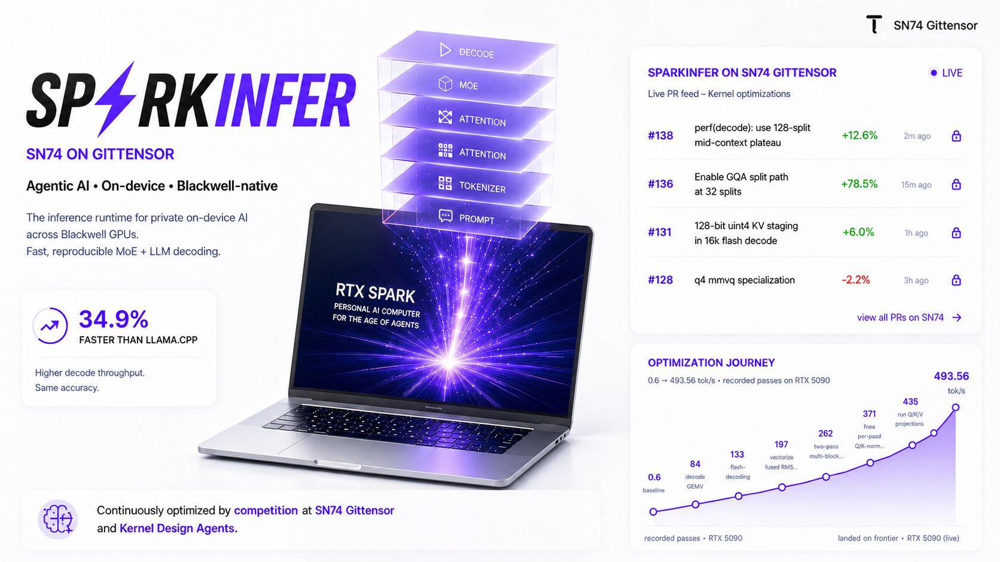

# SP⚡RKINFER · Powered by SN74

**Agentic AI inference. Optimized for every Blackwell GPU.**

A native C++/CUDA runtime for MoE/LLM decoding on Blackwell — from desk-side RTX to workstation
PRO 6000. No Python stack, a **2.5 MB** binary, and Blackwell-native kernels that run **+86%
faster than llama.cpp** on our SOTA model. Continuously optimized by open competition at
**[SN74 on Gittensor](https://gittensor.io/miners/repository?name=gittensor-ai-lab%2Fsparkinfer)**.

> **Fewer models. Deeper optimization. Faster evolution.**

## Run it

One command to an OpenAI-compatible endpoint. Weights download themselves on first run.

```bash
docker run --gpus all -p 8080:8080 -v qwen38:/models \
  ghcr.io/gittensor-ai-lab/sparkinfer-qwen38:latest
```

```bash
curl localhost:8080/v1/chat/completions -H 'Content-Type: application/json' -d '{
  "model": "qwen38-nvfp4",
  "messages": [{"role": "user", "content": "What is the capital of Japan?"}]
}'
```

Serves text, **images and video**. ~1 GB image, Blackwell (`sm_120`) only.
Build from source instead: [Quickstart](#quickstart).

Provenance is attested to the image digest:

```bash
gh attestation verify oci://ghcr.io/gittensor-ai-lab/sparkinfer-qwen38:latest \
  -R gittensor-ai-lab/sparkinfer
```

## Qwen3.8-27B — the model we optimize hardest

A dense hybrid Gated-DeltaNet model, and the checkpoint the automated eval scores **every PR**
against. We quantize it in house with NVIDIA ModelOpt for the RTX 5090's FP4 tensor cores:

### 📦 [gittensor-model-hub/Qwen3.8-27B-NVFP4-RTX5090](https://huggingface.co/gittensor-model-hub/Qwen3.8-27B-NVFP4-RTX5090)

Uniform NVFP4 on every `Linear`, 17.9 GB, full **262,144-token** context on one 32 GB card.

<!-- BENCH:qwen38-modelopt:start -->

| context | decode | prefill |
|---:|---:|---:|
| 128 | **95.7** tok/s | **6,942** tok/s |
| 4k | **93.6** tok/s | **14,364** tok/s |
| 16k | **90.2** tok/s | **13,794** tok/s |

<sub>Auto-refreshed by the ModelOpt eval bot at `44e1c4505` — these are the numbers that PR measured on the pinned RTX 5090, which after squash-merge are main's. Regenerated on every auto-merge, so the table cannot drift behind the code.</sub>
<!-- BENCH:qwen38-modelopt:end -->

Same weights the model was released with, re-quantized for the hardware it runs on — **+19–22%
decode / +135–179% prefill** over llama.cpp reading its best GGUF. llama.cpp cannot load NVFP4
compressed-tensors at all, so that is *each engine on the format it actually runs*, not a
same-weights benchmark. The same-weights comparison is [below](#same-weights-gguf-on-both-sides),
short-prompt loss included.

[unsloth/Qwen3.8-27B-NVFP4](https://huggingface.co/unsloth/Qwen3.8-27B-NVFP4) (NVFP4 FFN + FP8
attention) is equally supported and loads through the same path — 84.9 tok/s decode / 5,031 tok/s
prefill at ctx=128, measured at `d8e1c74`. The eval *scores* PRs on our build and runs a separate
*no-regression guard* on the upstream one, which stops an optimisation winning on one checkpoint
by pessimising the other.

### DSpark speculative decode

Qwen3.8-27B also ships a **DSpark** draft — a five-layer semi-autoregressive block drafter that
proposes a block per step and has the target verify it in one batched pass, so accepting *k*
tokens costs one target forward instead of *k*.

Across contexts, on the committed workload corpus (`bench/scripts/workloads.py`, 128-token
outputs, greedy, batch 1, best of 3), against the autoregressive baseline measured in the same
process and model load:

| | 4K | 16K | 32K |
|---|---:|---:|---:|
| **mean speedup over AR** | **4.01×** | **2.97×** | **2.63×** |
| AR reference | 91.0 tok/s | 86.4 | 81.3 |

Speculative throughput depends almost entirely on how predictable the generated text is, so a
single number is misleading in either direction. The gated regression check below runs the
*hardest* case — long-context prose at 16k, where acceptance is lowest — and is the figure that
must not regress:

<!-- BENCH:qwen38-dspark:start -->

| context | DSpark decode | AR decode | speedup | mean accepted (τ) |
|---:|---:|---:|---:|---:|
| 16k | **130.3** tok/s | 88.6 tok/s | **1.471×** | 1.730 |

<sub>**Lossless**: the eval regenerates the same prompt with the draft disabled and requires the two token sequences to be byte-identical, so this is exact-token equality with autoregressive decode, not distributional agreement. A run that is not lossless is rejected regardless of speed.</sub>

<sub>Measured at ctx=16384 on `bench/scripts/bench_prompt_32k.txt`. Speculative throughput depends on how predictable the generated text is — the same build measures a materially different τ on prose, code and repetitive text — so treat this as that workload at that context, not a general serving figure. The AR column is the autoregressive decode measured in the same process, same model load, same GPU state.</sub>

<sub>Auto-refreshed by the DSpark eval bot at `b5c957421` — these are the numbers that PR measured on the pinned RTX 5090, which after squash-merge are main's. Regenerated on every auto-merge, so the table cannot drift behind the code.</sub>
<!-- BENCH:qwen38-dspark:end -->

The two tables measure different corpora, which is the whole point: 4.01× on a mixed workload at
4k and 1.474× on long-context prose at 16k are both true. Quote the range, not a single figure.

Speculation only pays when the verify costs less than what it replaces:
`speedup ≈ τ / (verify cost + draft cost)`, both in target forwards. That is why τ alone is not the
story — a block that accepts more tokens but costs more to verify is slower, and for most of this
feature's life DSpark ran *below* plain AR decode for exactly that reason.

### Same weights, GGUF on both sides

To make the engine comparison fair, the same `Q4_K_M` GGUF
([unsloth](https://huggingface.co/unsloth/Qwen3.8-27B-GGUF)) through both engines. RTX 5090,
greedy bs=1, sparkinfer `d8e1c74` vs `llama.cpp d8df12e`:

| context | decode | | prefill | |
|---:|---:|---:|---:|---:|
| | **SparkInfer** | llama.cpp | **SparkInfer** | llama.cpp |
| 128 | **86.9** (+8.4%) | 80.2 | 2,033 (−26.9%) | **2,782** |
| 4k | **85.2** (+10.6%) | 77.0 | **7,548** (+105.7%) | 3,670 |
| 16k | **82.3** (+11.5%) | 73.9 | **7,596** (+117.2%) | 3,496 |

Prefill crosses over at ~512 tokens. The short-prompt loss is published rather than omitted, and it
has a cause: reading a Q4_K_M GGUF means dequantizing Q4_K into the GEMM operand on every pass, a
fixed cost 128 tokens cannot amortize but 4k easily does. It is a live optimisation target, tracked
by the same automated eval that gates every PR. sparkinfer's own NVFP4 checkpoints do not pay that
dequant and reach 5,031–6,942 pp at the same ctx=128.

## Other models

**[Qwen3.6-35B-A3B](https://huggingface.co/unsloth/Qwen3.6-35B-A3B-GGUF)** — hybrid
Gated-DeltaNet + full-attention MoE, our SOTA speed target:
**512 tok/s decode vs llama.cpp's 276 on the same GGUF and GPU — +86%**, rising to **+127% prefill
at 32k**. Quality parity: top-1 **0.953** · KL **0.031** · IFEval **83%** · BFCL **75%**.
Full tables: [`bench/competitors/latest-results.md`](bench/competitors/latest-results.md) ·
[`bench/quality/README.md`](bench/quality/README.md).

**[Spark-X2.5-4B](https://huggingface.co/XHToken/Spark-X2.5-4B)** — iFlytek's `spark2_5`, a
dense GQA-16 stack that alternates **three sliding-window layers (512 tokens) with one
full-attention layer**, each kind carrying its *own* rotary parameters (sliding: θ=1e4 over all
256 head dims; full: θ=5e6 over 64 of 256), a per-head sigmoid attention gate, and a GeGLU FFN.
**235 tok/s decode, 6.4 GB VRAM** (Q8_0, RTX 5090). Mainline llama.cpp cannot load this
architecture at all — it needs a fork.

Correctness is checked against an independent implementation built from the GGUF's own bytes,
[`bench/scripts/spark25_ref_check.py`](bench/scripts/spark25_ref_check.py) — it re-derives the
forward pass from the reference `modeling_spark.py` and shares no code with the runtime. One
teacher-forced pass over prompt + generation verifies every greedy step at once:

| Prompt | Sliding window | Greedy steps agreeing | Disagreement margin | Median margin |
|---|---|---|---|---|
| 23 tokens | not engaged | **23 / 24** | 0.056 | 2.28 |
| 1329 tokens | engaged | **10 / 11** | 0.344 | 2.80 |

In each run the single disagreement is the *smallest-margin step of that run* — a near-tie the
reference's fp32 NumPy and the runtime's bf16/Q8_0 arithmetic settle differently. A wrong rope
theta, rotary width, window, gate or activation would disagree at large margins and across many
steps, not at the one place the model itself was indifferent.

SparkInfer focuses on the models driving the future of AI — not thousands of legacy architectures.

## Blackwell native

Built for NVIDIA Blackwell from the beginning (`sm_120` + `sm_121`, not datacenter `sm_100`).

| GPU | Arch | Target |
|---|---|---|
| [RTX Spark GB10](https://nvidianews.nvidia.com/news/nvidia-microsoft-windows-pcs-agents-rtx-spark) | `sm_121` | Personal AI PC · desk-side agents |
| [DGX Spark](https://www.nvidia.com/en-us/products/workstations/dgx-spark/) | `sm_121` | AI workstation |
| [RTX 5090](https://www.nvidia.com/en-us/geforce/graphics-cards/50-series/rtx-5090/) | `sm_120` | Consumer Blackwell · current dev platform |
| [RTX PRO 6000](https://www.nvidia.com/en-us/products/workstations/) | `sm_120` | 96 GB workstation · 32k/4k API profile |

Runtime footprint, excluding model weights:

| runtime | size | vs sparkinfer |
|---|---:|---:|
| sparkinfer native binary | **2.5 MB** | 1× |
| llama.cpp CUDA | 80 MB | 33× larger |
| vLLM | 605 MB | 243× larger |

## Powered by SN74 — optimization that never stops

This runtime is not optimized by a team on a roadmap. It is optimized by **open competition**:
contributors submit PRs, a bot verifies correctness and speed on real RTX 5090 hardware, and SN74
rewards **verified marginal speedups**. Every merge has to prove itself on the same GPU.

**15 releases in 3 weeks** — from first llama.cpp beat to +86% decode / +127% prefill @ 32k.

1. Pick a narrow bottleneck in the Blackwell decode path.
2. Submit a PR with source changes and benchmark evidence.
3. The bot builds `main` and the PR on the same RTX 5090.
4. Correctness vs llama.cpp; guards at 128 / 512 / 4k / 16k / 32k decode.
5. Strongest context improvement scores; regressions get `regression-*` labels.
6. Frontier merges; the [dashboard](https://gittensor-ai-lab.github.io/sparkinfer/dashboard/) updates.

Because the benchmark tables above are regenerated on every auto-merge, they cannot drift behind
the code. Miner workflow: [`docs/miner-guide.md`](docs/miner-guide.md).

## Roadmap

### Milestone 1 · Now — fast on every Blackwell edge GPU

*Fastest = cost-effective inference* — more tokens per dollar on Blackwell edge first.

- Qwen3.6 SOTA: **+86%** decode / **+127%** prefill @ 32k vs llama.cpp on RTX 5090
- RTX PRO 6000 — **32k input + 4k output**, full MoE resident
- RTX Spark + DGX Spark `sm_121` bring-up for desk-side agents
- Fastest AI runtime at the edge · desktop app, RAG, memory

### Milestone 2 · Next — trustable AI on confidential compute

Attested builds and sealed execution on PRO 6000 server and B200.

- TDX + NVIDIA CC attestation for `sparkinfer-server` workloads
- Source-verified binaries — same eval loop, inside the enclave
- Privacy guardrails and end-to-end encryption
- Licensed on-prem runtime for regulated enterprise

## Quickstart

Prefer the [Docker image](#run-it). To build and benchmark from source on Blackwell (CUDA 12.8+) —
scripts auto-detect GPU arch, fetch prebuilt binaries or build from source, and download the model:

```bash
# decode throughput (fetches Qwen3-30B-A3B Q4_K_M on first run)
bench/scripts/bench.sh --download

# head-to-head vs llama.cpp on the same GGUF + GPU
bench/scripts/bench.sh --download --compare

# accuracy gate — token-match / KL vs llama.cpp
bench/scripts/accuracy.sh --download
```

Your own model: `bench/scripts/bench.sh /path/to/model.gguf --tokens 256`.
Options: [`bench/scripts/README.md`](bench/scripts/README.md).

## Layout & scoring

| Path | What |
|---|---|
| [`kernels/`](kernels) | CUDA kernels — flash-decode, decode GEMV, fused MoE FFN, GEMM, RMSNorm, RoPE, GGUF dequant |
| [`runtime/`](runtime) | scheduler, paged KV cache, CUDA-graph decode, native GGUF loading, model forward |
| [`moe/`](moe) | sync-free MoE router + expert dispatch |
| [`bench/`](bench) | reproducible benchmarks + eval harness |
| [`dashboard/`](dashboard) | static frontier dashboard (GitHub Pages) |
| [`server/`](server) | OpenAI-compatible HTTP API (`BUILD_SERVER=ON`), incl. [image input](docs/image_input.md) |

**Scoring is speedup-only.** SN74 pays verified marginal speedups labeled **XL / L / M / S / XS**. Sub-2% gains are never aggregated across contexts. See [`.gittensor/weights.json`](.gittensor/weights.json).

## Build

Requires **CUDA Toolkit 12.8+** (`sm_120` / `sm_121` codegen).

```bash
cmake -B build -DCMAKE_CUDA_ARCHITECTURES=120   # or 121 for RTX Spark / Jetson Thor
cmake --build build -j
ctest --test-dir build
```

## Automated evaluation

Open a PR — a bot evaluates every ~30 min: source build on RTX 5090, correctness gate vs llama.cpp, no-regression guards, **`eval:<label>`** verdict. The bot **never auto-merges**. Details: [`eval/`](eval) · **[EVAL-TRUST.md](EVAL-TRUST.md)** (Polaris TDX receipts, reproducible from source today).

| label | meaning |
|---|---|
| `XL · L · M · S · XS` | verified speedup over frontier, by % gain |
| `none` | correct, no verified improvement |
| `REJECT` | failed correctness or regression |
| `BASELINE` | first verified frontier entry |

## Contributing

Source-required and reproducible. Before a PR: `bench/scripts/bench.sh` + `bench/scripts/accuracy.sh`. See [CONTRIBUTING.md](CONTRIBUTING.md).

## License

[MIT](LICENSE) · [Changelog](CHANGELOG.md)
